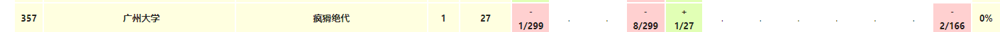

# CCPC2023 网络赛：



:cry:没开出A ， 差一点就可以给自己打上一个名额。
一个小小的区间加，我竟然没有自己写，于是成哥写寄了。并且我也没有意识到。

反思是，这些基本的东西，也是可以自己写的，并且可以对这些基本的问题，自行封装出一个板。一个比较好写的板。

并且这一次的调试能力不够强 ， 少了vs就很难受。

## A ： 


## solve

很显然的计数dp问题： 
浑水摸鱼：

**状态定义：**
$f_{i ,j }$ 表示将1....i分为j段。共有多少种方案数：

**状态转移：**

显然是不可行的。如果对一个计数，研究具体的细节时候，发现关注局部之间的转移，就必须花费一定量的花费时候，就意味着应该从整体上考虑其贡献，以及转移。

**状态设计更新：**

$f_{i}$ 表示以i为结尾的每个方案的$len^2$ 的贡献。

**状态转移：**
$$
f_{i}->f_{i + 1}\\
\sum f(i) i^2->\sum f(i)\times (i + 1)^2\\
->\sum f(i)\times i^2 + 2\times\sum f(i)\times i + \sum f(i)
$$


于是分别维护三个变量即可：

$f1(i)->\sum f(i)\times i^2$

$f2(i)->\sum f(i)\times i$

$f3(i)->\sum f(i)$

由考察i为尾段之后拼上一个新的区间的方案更新情况，就是找打一个最大符合题意得前缀：可以使用二分+字符串哈希实现，（先匹配最大前缀，跳过第一个不匹配值。继续匹配第二个后缀。）

区间加法，这一块得实现方式很多。有线段树和差分数组。当时太急，没有考虑具体选择。


#### code

赛时代码，没有交过。可能会出错；

调整，单哈希被卡了。

```cpp
#include<bits/stdc++.h>
using namespace std;
using ll = long long;
#define int ll
#define fi first
#define se second
#define sz(x) (int)(x).size()
const int mod = 998244353;
const int mod2 = 1E9 + 7;
const int N = 1E6 + 10;

int f1[N] , f2[N] , f3[N];
void add(int& a , int b) {
	a += b;
	if (a >= mod) a -= mod;
	if (a < 0) a += mod;
}

class shash {
public:
	vector<ll> pres;
	vector<ll> epow;
	ll e , p;
	shash() {};
	shash(string& s , ll e , ll p) {
		int n = sz(s);
		this->e = e;
		this->p = p;
		pres = vector<ll>(n + 1);
		epow = vector<ll>(n + 1);
		epow[0] = 1;
		for (int i = 0; i < n; i++) {
			pres[i + 1] = (pres[i] * e + s[i]) % p;
			epow[i + 1] = epow[i] * e % p;

		}
	}
	ll operator()(int l , int r) {
		ll res = (pres[r + 1] - pres[l] * epow[r - l + 1] % p) % p;
		return (res + p) % p;
	}
};
array<shash , 2> ss;
array<shash , 2> tt;
bool check(int l1 , int r1 , int l2 , int r2) {
	return ss[0](l1 , r1) == tt[0](l2 , r2) && ss[1](l1 , r1) == tt[1](l2 , r2);
}
signed main() {
	ios::sync_with_stdio(false);
	cin.tie(0);
	string s , t;
	cin >> s >> t;
	int n = sz(s);
	int m = sz(t);
	ss = {shash (s , 1331 , mod) , shash(s , 1221 , mod2)};
	tt = {shash (t , 1331 , mod) , shash(t , 1221 , mod2)};
	int cunt = 0;
	//顺序是先枚举i ， 然后更新到后边的结构：
	for (int i = 0; i < n; i++) {
		// 检查当前定位情况：
		add(f1[i + 1] , f1[i]);
		add(f2[i + 1] , f2[i]);
		add(f3[i + 1] , f3[i]);
		if (i < m) {
			if (s[i] != t[i]) {
				cunt++;
			}
			if (cunt <= 1) {
				add(f1[i + 1] , 1);
				add(f1[i + 2] , -1);

				add(f2[i + 1] , 1);
				add(f2[i + 2] , -1);

				add(f3[i + 1] , 1);
				add(f3[i + 2] , -1);
			}
		}

		if (i == n - 1) break;
		/*起点*/
		int l1 = i + 1 , l2 = 0;
		/*可能的长度*/
		int low = 1 , high = min({n - i - 1 , m});
		while (low < high) {
			int mid = (low + high + 1) / 2;

			//尾部
			int  r1 = l1 + mid - 1;
			int  r2 = l2 + mid - 1;
			// 当前的最低位置：
			if (check(l1 , r1 , l2 , r2)) {
				low = mid;
			} else high = mid - 1;
		}
		/*长度*/
		if (low == 1) {
			if (s[i + 1] != t[0]) {
				l1 = i + 2;
				l2 = 1;
			} else {
				l1 = i + 3;
				l2 = low + 1;
			}
		} else {
			l1 = i + low + 2;
			l2 = low + 1;
		}
		int r1;
		if (l1 < n && l2 < m) {
			low = 1 , high = min({n - l1 , m - low});
			while (low < high) {
				int mid = (low + high + 1) / 2;
				int  r1 = l1 + mid - 1;
				int  r2 = l2 + mid - 1;
				if (check(l1 , r1 , l2 , r2)) {
					low = mid;
				} else high = mid - 1;
			}
			if (low == 1 && s[l1] != t[l2]) {
				r1 = l1 - 1;
				l1 = i + 1;
			}
			else {
				r1 = l1 + low - 1;
				l1 = i + 1;
				r1 = min(n - 1 , r1);
			}
		} else if (low == m) {
			l1 = i + 1;
			r1 = i + low;
		} else if (l1 >= n) {
			l1 = i + 1;
			r1 = n - 1;
		}

		// cout << i + 1 << "\tcur\n";
		// cout << l1 << " " << r1 << "\n";
		/*于是现在定位到了， i .... 最长*/
		/*长度设置为l1 , l2*/
		/*整个区间进行区间加的操作：*/
		ll q1 = f1[i + 1] , q2 = f2[i + 1] , q3 = f3[i + 1];
		// f1.update(l1 , r1 , (1LL * q1 + 2LL * q2 % mod + q3) % mod);
		add(f1[l1 + 1] , (q1 + 2 * q2 + q3) % mod);
		add(f1[r1 + 2] , ((-1 * (q1 + 2 * q2 + q3) % mod) + mod) % mod);

		add(f2[l1 + 1] , (q2 + q3) % mod);
		add(f2[r1 + 2] , (-(q2 + q3) % mod + mod) % mod);

		// f3.update(l1 , r1 , q3);
		add(f3[l1 + 1] , q3);
		add(f3[r1 + 2] , (-q3 % mod + mod) % mod);
		// cout << f1[i + 1] << " "  << f2[i + 1] << " " << f3[i + 1] << "\n";
	}
	cout << f1[n] << "\n";
}
```

