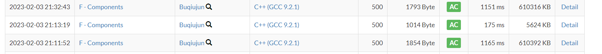

[F - Components (atcoder.jp)](https://atcoder.jp/contests/abc287/tasks/abc287_f)

#### 题意

给定一颗树。求拥有x个连通块的导出子图的方案个数方案总数。

#### 20min(一团糟)

定义状态$f_{i,j，0/1}$表示当前以为根i节点的子树中，（选择/不选择根）子树下连通块为j的导出子图的方案个数。
$$
第一种类型：\\
f[u][sons2][x][0] = \sum(f[sons2][endsonOfsons2][j][0/1]\times f[u][sons1][x-j][0])
$$

$$
第二种类型：\\
f[u][sons2][x][1] = \sum(f[sons2][endsons2][j][0]\times f[u][sons1][x-j][1]\\+f[sons2][endson2][j][1]\times f[u][son1][x-j+1][1]);
$$

上面的状态很乱。为了更好表示理解，写出了存储的结构交叉，分离。

???于是复杂度啥?

对每一个节点假设儿子总数位$sons$,k= N。

则对于每一个节点贡献为：

$sons \times N^2$

由于$\sum sons = N$

所以其实总复杂度数为：

$N^3$

-------------

2. 答案的统计方法.

根据子问题的定义，根节点的子问题的解。


#### official Editorial

转移方程并不一样。题解的转移关注了：

1. 对于一颗特定顶点数的子树，它的可达连通块数量是有限的。只枚举这一部分，可以做到很有效果的优化。
2. 在上述的优化下。通过严格的证明，可以知道这种树形dp的复杂度为$O(n^2)$


证明过程参照：

[树上背包的上下界优化 - ouuan - 博客园 (cnblogs.com)](https://www.cnblogs.com/ouuan/p/BackpackOnTree.html)

#### 生长思考：

1. 作为一个特殊复杂度专题并入树状数组的笔记。
2. 转移设计
   习惯上，自己的转移设计总是，先枚举k个连通块。再枚举该连通块下的方案。这是强调新状态的转移角度。而这份代码的角度是强调子问题的角度。通过通过枚举所有的子规模问题。构造出新状态。并补充当前新状态函数的解。这样的角度似乎更清晰。
3. 常数问题：



题解代码快了十倍。优化了相当多。和自己写的代码相比，哪里更优？
 第一点能拆解的都拆了。发现还是差不多。比如说关键的循环的个数什么都是一样的。
 最大的差别应该是：自己的f数组全部开了全局。而题解代码，全开局部，并且宁可函数设计时候开引用传参。

总之逆天。

#### code
##### 题解代码

```cpp
#include <bits/stdc++.h>
#include <atcoder/modint>
using namespace atcoder;
using mint = modint998244353;
using namespace std;

vector<vector<mint>> dfs(int c,int p,vector<vector<int>> &E){
	vector dp(2,vector<mint>(2,0));
	dp[0][0] = 1;
	dp[1][1] = 1;
	for(int i=0;i<E[c].size();i++){
		int to = E[c][i];
		if(to==p)continue;
		
		auto ret = dfs(to,c,E);
		vector ndp(2,vector<mint>(dp[0].size()+ret[0].size()-1,0));
		for(int j=0;j<dp[0].size();j++){
			for(int k=0;k<ret[0].size();k++){
				ndp[0][j+k] += dp[0][j] * (ret[0][k] + ret[1][k]);
				ndp[1][j+k] += dp[1][j] * ret[0][k];
				if(j+k>0)ndp[1][j+k-1] += dp[1][j] * ret[1][k];
			}
		}
		swap(dp,ndp);
	}
	return dp;
}

int main() {
    
	int N;
	cin>>N;
	
	vector<vector<int>> E(N);
	for(int i=0;i<N-1;i++){
		int a,b;
		cin>>a>>b;
		a--,b--;
		E[a].push_back(b);
		E[b].push_back(a);
	}
	
	auto ret = dfs(0,-1,E);
	
	for(int i=1;i<=N;i++){
		cout<<(ret[0][i] + ret[1][i]).val()<<endl;
	}
	
	return 0;
}
```

##### myself

````cpp
#include<bits/stdc++.h>
using namespace std;
using ll = long long;

const int N = 5E3 + 10;

ll mod = 998244353;

const int maxn = 1e6 + 10;
struct edge
{
	int t, next;
} e[maxn << 1];
int tot, head[maxn];
void add(int x, int y)
{
	e[++tot].t = y;
	e[tot].next = head[x];
	head[x] = tot;
}

ll f[N][N][2]; // 表示当前节点是否选择。连通块数量。
int sz[N]; // 定义一个size.来减枝。

int main()
{
	ios::sync_with_stdio(false);
	cin.tie(0);

	int n;
	cin >> n;
	for (int i = 1; i < n; i++)
	{
		int x , y;
		cin >> x >> y;
		add(x , y);
		add(y , x);
	}

	function<void (int , int)> dfs = [&](int cur , int par)->void
	{
		sz[cur] = 1;
		f[cur][1][1] = 1;
		f[cur][0][0] = 1;
		for (int i = head[cur]; i ; i = e[i].next)
		{
			int to = e[i].t;
			if (to == par)continue;
			//转移方程；
			dfs(to , cur);
			//用来暂时存储现在的接下来的方案。
			ll dp[N][2] {};
			for (int x = 0 ; x <= sz[cur] ; x++)
				for (int y = 0; y <= sz[to] ; y++)
				{
					//状态转移;
					dp[x + y][0]  = (dp[x + y][0] + f[cur][x][0] * f[to][y][0]) % mod;
					dp[x + y][0]  = (dp[x + y][0] + f[cur][x][0] * f[to][y][1]) % mod;
					dp[x + y][1]  = (dp[x + y][1] + f[cur][x][1] * f[to][y][0]) % mod;
					if (x != 0 || y != 0)
						dp[x + y - 1][1] = (dp[x + y - 1][1] + f[cur][x][1] * f[to][y][1]) % mod;
				}
			sz[cur] += sz[to];
			for (int j = 0; j <= sz[cur] ; j ++)
			{
				f[cur][j][0] = dp[j][0];
				f[cur][j][1] = dp[j][1];
			}
		}
	};

	dfs(1 , 0);

	for (int i = 1; i <= n; i++)
	{
		cout << (f[1][i][0] + f[1][i][1]) % mod << '\n';
	}

}

/* stuff you should look for
* int overflow, array bounds
* special cases (n=1?)
* do smth instead of nothing and stay organized
* WRITE STUFF DOWN
* DON'T GET STUCK ON ONE APPROACH
*/
````