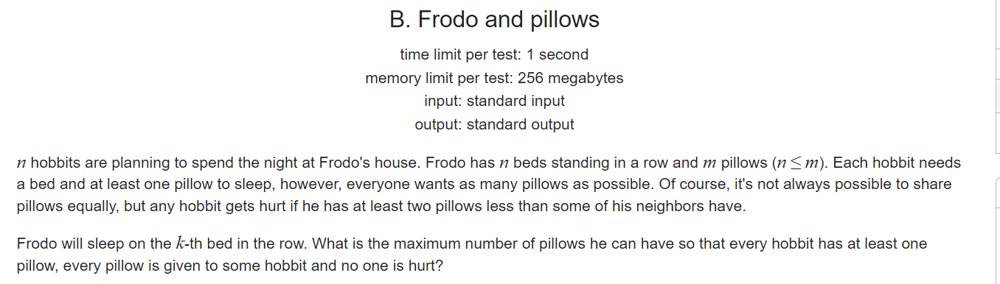

**B. Frodo and pillows**

https://codeforces.com/contest/760/problem/B



#### solve

最优方案是以k位置为做高 ，然后往两边逐步降。注意最小值为1.二分求出临界值。
整体来说有一些小计算。处理起来有些麻烦。

#### code
```cpp
#include<bits/stdc++.h>
using namespace std;
using ll = long long;

const int N = 1E6 + 10;
ll n , m , k;
ll l , r;
bool check(ll x) {
	ll suml = 0 , sumr = 0;
	if (x > l) {
		suml = (x - 1 + x  - l) * l / 2;
	} else {
		suml = x * (x - 1) / 2;
		suml += (l - x + 1);
	}

	if (x > r) {
		sumr = (x - 1 + x - r) * r / 2;
	} else {
		sumr = x  * (x - 1) / 2;
		sumr += (r - x + 1);
	}
	return suml + sumr + x <= m;
}
int main()
{
	ios::sync_with_stdio(false);
	cin.tie(0);

	cin >> n >> m >> k;
	int low = 1, high = m;
	//两边的长度。
	l = k - 1;
	r = n - k;
	while (low < high) {
		int mid = (low + high + 1) / 2;
		if (check(mid)) {
			low = mid;
		} else {
			high = mid - 1;
		}
	}
	cout << low << '\n';
}

/* stuff you should look for
* int overflow, array bounds
* special cases (n=1?)
* do smth instead of nothing and stay organized
* WRITE STUFF DOWN
* DON'T GET STUCK ON ONE APPROACH
*/
```