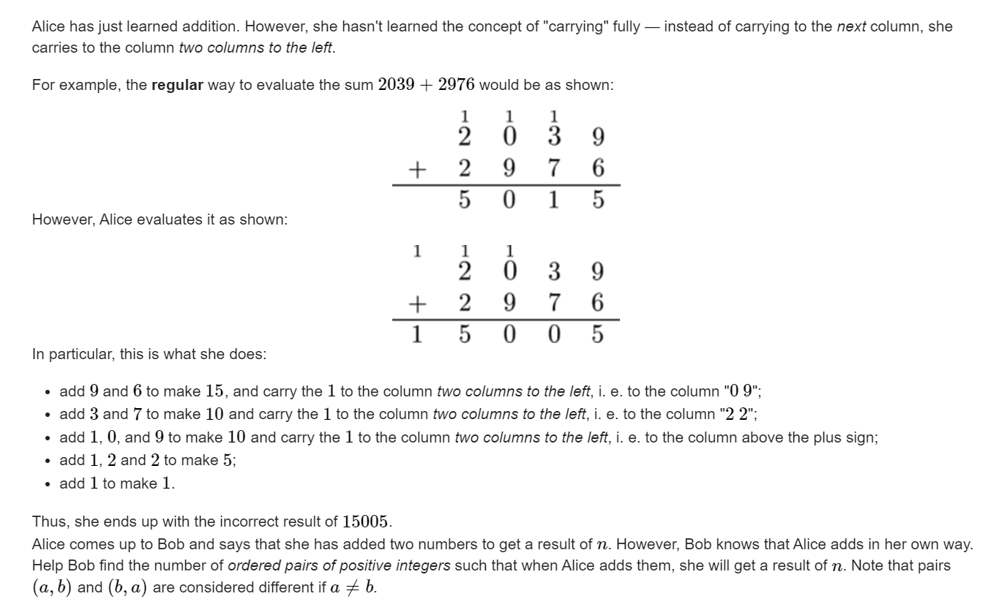

**C. Carrying Conundrum**

https://codeforces.com/contest/1567/problem/C



**提供两种解决思路：**

1. 性质挖掘：

   发现问题转变成，奇数上的进位 ， 进到下一位奇数位。于是问题转变成， 于是奇数位，偶数位两个位置相独立。求出“奇数x”，以及偶数的方案然后拼接起来即可。（x + 1）(y + 1) - 2 。注意去除去除一项拼接成0的方案。

2.  dp角度

   **定义dp**

   dp\[i][0/1/2]表示对后 1 ， 2 位产生 进位进位 ， 前i个数上已经相同的方案数目。

   **状态转移：**

   枚举a当前位选什么 ， 枚举更小规模的状态。然后通过当前位上的结果 ， 枚举是否有进位。然后由后往前（重点在更小规模状态）贡献转移即可。

#### code1模型性质挖掘：

```cpp
#include<bits/stdc++.h>
using namespace std;
typedef long long ll;
const int oo = 0x0fffffff;
const int N = 1E6 + 10;
void work(int testNo)
{
	string s; cin >> s;
	int x = 0 , y = 0;
	//reverse(s.begin() , s.end());
	for (int i = 0; i < (int)s.size(); i += 2) {
		x = x * 10 + (s[i] - '0');
	}
	for (int i = 1; i < (int)s.size(); i += 2) {
		y = y * 10 + (s[i] - '0');
	}
	cout << (x + 1)*(y + 1) - 2 << '\n';
}
int main()
{
	ios::sync_with_stdio(false);
	cin.tie(0);

	int t; cin >> t;
	for (int i = 1; i <= t; i++)work(i);
}
```
