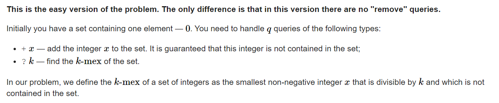

**D1. Balance (Easy version)**
https://codeforces.com/contest/1732/problem/D1
[Problem - D1 - Codeforces](https://codeforces.com/contest/1732/problem/D1)

#### 简介：



#### solve

1. 最暴力的方法： 
   1. map维护直接插入：
   2. 从小到大枚举k的若干倍 ， 检查是否存在直到找出答案。

2. 优化：

   1. 记忆化，对每一次询问记忆即可。（因为中途不会出现删除数字的操作 ， 因此这个答案是可持续使用的。）

   2. 复杂度估算：

      1. 链子比较短 ， 短于500 可以忽略不记；一次查询。

      2. 链子比较长： 第一次的复杂度就是该链子： 考虑基于同一条长链的查询 ：
         $$
         \sum \frac {len}{1} + \frac {len}{2} +... + 1 = len\sum_{d = 1}^{len} \frac {1}{d}\\
         = len\times log(len)
         $$
   
      3. 长链子比较多。 长度大于 1000 的最多200.也就是说，然后剩下的每次询问的复杂度为1000： 总的来说过是 1000 * 200。也许带个log。

#### 生长思考 ：

1. 暴力小优化， 对于一些比较特殊的模型， 认真审视复杂度。
   1. 分块。
   2. 图的度数分布
   3. 上述调和函数类型的形式。

#### code

```cpp
map<ll , ll> mp1 , mp2;

signed main()
{
	ios::sync_with_stdio(false);
	cin.tie(0);
	int q;
	cin >> q;
	while (q--) {
		char ch; ll x;
		cin >> ch >> x;
		if (ch == '+') {
			mp1[x] = 1;
		} else {
			if (mp2.count(x) == 0)mp2[x] = 1;
			int p = mp2[x];
			while (mp1[p * x])
				p++;
			mp2[x] = p;
			cout << x * p << "\n";
		}
	}
}
```

 
