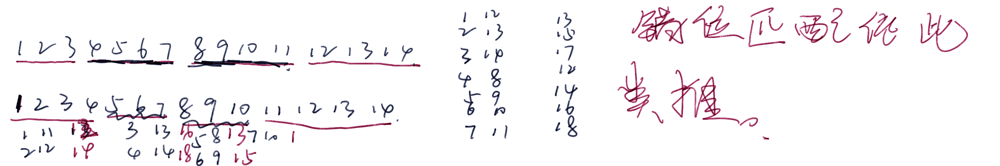

[Problem - C - Codeforces](https://codeforces.com/contest/1788/problem/C)

给定一个长度为1.....2n的排列。

构造出n组 pair使得他们的和成一个等差数列（d=1)。


#### solve

1. 列个方程可以发现，

   首项为$\frac{3}{2}(n+1)$

2. 关注中位数为：$\frac{3}{2}*(n+1)+(n-1 )/2=2n+1$

几个问题

1. 当n=奇数时候，是否一定有解？

证明不出来，就找一个构造方式。

并且这种构造方式应该是，规整自然的。




通过长度进行发分界。

$m = (n - 1)/2$ 
$$
(1,3m+3)->....(m,4m+2)\\
(m+1,2m+2)->...(2m+1,3m+2)
$$

```cpp
#include<bits/stdc++.h>
using namespace std;
typedef long long ll;

const int oo = 0x0fffffff;
const int N = 1E6 + 10;

void work(int testNo)
{
	int n;
	cin >> n;
	if (n % 2 == 0) {
		cout << "NO\n";
		return;
	}
	cout << "Yes\n";
	int m = (n - 1) / 2;
	for (int i = 1; i <= m; i++) {
		cout << i << ' ' << 3 * m + 2 + i << '\n';
	}
	for (int i = m + 1; i <= n; i++) {
		cout << i << ' ' << m + 1 + i  << '\n';
	}
}


int main()
{
	ios::sync_with_stdio(false);
	cin.tie(0);

	int t; cin >> t;
	for (int i = 1; i <= t; i++)work(i);
}

/* stuff you should look for
* int overflow, array bounds
* special cases (n=1?)
* do smth instead of nothing and stay organized
* WRITE STUFF DOWN
* DON'T GET STUCK ON ONE APPROACH
*/
```


