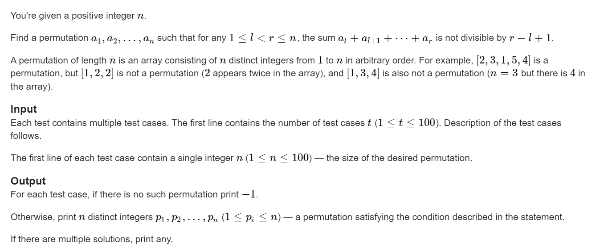

https://codeforces.com/contest/1818/problem/B

**B. Indivisible**



#### solve

没什么好说的；结论看下面代码

#### code

```cpp
#include<bits/stdc++.h>
using namespace std;

using ll = long long;
using i64 = long long;
using ull = unsigned long long;
using ld = long double;
using uint = unsigned int;
using pii = pair<int , int>;
using pli = pair<ll , int>;
using pll = pair<ll , ll>;


#define dbg(x) cerr << "[" << __LINE__ << "]" << ": " << x << "\n"

#define all(x) (x).begin(),(x).end()
#define sz(x) (int)(x).size()
#define pb push_back
#define fi first
#define se second

const int inf = 1 << 29;
const ll INF = 1LL << 60;
const int N = 1E6 + 10;

int ans[N];
void work(int testNo)
{
	int n;
	cin >> n;
	if (n == 1) {
		cout << 1 << "\n";
		return;
	}
	if (n % 2) {
		cout << -1 << "\n";
		return;
	}
	int high = 2 , low = 1;
	for (int i = 1; i <= n; i += 2, low += 2 , high += 2) {
		ans[i] = high;
		ans[i + 1] = low;
	}
	for (int i = 1; i <= n; i++) {
		cout << ans[i] << " \n"[i == n];
	}
}


signed main()
{
	ios::sync_with_stdio(false);
	cin.tie(0);

	int t; cin >> t;
	for (int i = 1; i <= t; i++)work(i);
}

/* stuff you should look for
* int overflow, array bounds
* special cases (n=1?)
* do smth instead of nothing and stay organized
* WRITE STUFF DOWN
* DON'T GET STUCK ON ONE APPROACH
*/
```

