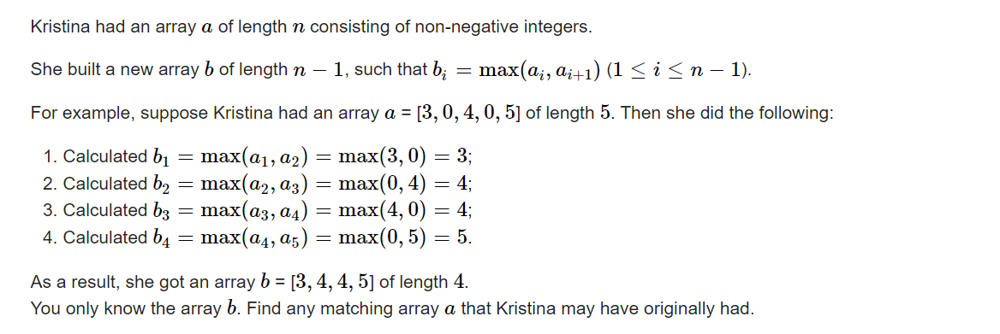

C. Restore the Array

[Problem - C - Codeforces](https://codeforces.com/contest/1811/problem/C)



#### solve ==不懂==

一种构造方法：
$$
a[1] = b[1]\\
a[n]=b[n - 1]\\
对于中间的元素：\\
a[i]=min(b[i],b[i - 1])\\
$$
验证如下：

$b[i]=max(a[i],a[i+1])$

对于两边：
$$
max(a[1] , a[2])=max(b[1] , min(b[1],b[2]))=b[1]\\
max(a[n-1],a[n])=max(min(b[n - 1] , b[n-2]) , b[n-1])=b[n-1]
$$
对于中间：
$$
max(a[i] , a[i+1]) = max(min(b[i-1] , b[i]) , min(b[i] , b[i + 1]))\\
$$
对于合法的$b[i - 1] , b[i] , b[i+ 1]$ ， 不可能出现 
$b[i-1]\lt b[i] 且 b[i + 1] \lt b[i]$否则无解。

证明如下：b[i]在中间， 即中间必然出现一个数字 b[i] 。该数字贡献两个位置， 而相邻b[i - 1] ， b[i + 1]小于b[i] ， 说明a数组中对应b[i] 相邻必然为小于它的数字， 就会贡献两项。矛盾。


$$
综上（3）分类展开如下：\\
max(b[i - 1] , b[i])\\
max(b[i] , b[i + 1])\\
max(b[i] , b[i])\\
显然三种的结果都为b[i].
$$

#### code

```cpp
int a[N] , b[N];

void work(int testNo)
{
	int n;
	cin >> n;
	for (int i = 1; i < n; i++)
		cin >> b[i];
	cout << b[1] << ' ';
	for (int i = 1; i < n - 1; i ++)
		cout << min(b[i] , b[i + 1]) << ' ';
	cout << b[n - 1] << '\n';
}
```


