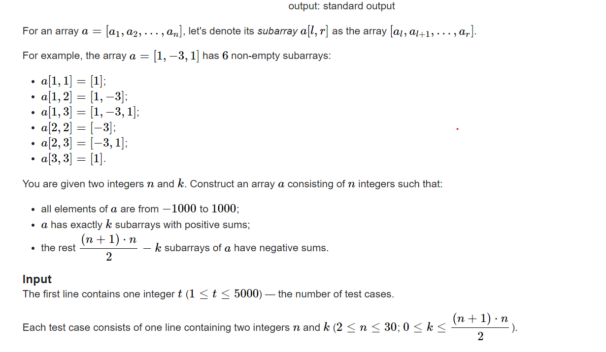

**C. Sum on Subarrays**

[Problem - C - Codeforces](https://codeforces.com/contest/1809/problem/C)



#### solve

**构造思想：**
1. 连续
1. 有序
1. 简洁
1. 特殊

**关键问题**

1. 怎么精准控制k的大小？

考虑==连续==的填一些正整数。发现不断填的过程中，每一步贡献的变化过程为：$+x$（x指的是当前已经有多少个连续的正数在数组中。）
逐渐的贡献会超过k ， 此时我们停止内部的贡献。
于是我们补上第一个负数。追求补回来。因为==控制负数的大小==可以使得贡献为$[0...remaind]$

为了使得其它段不会产生贡献：于是其它==特殊的==填上最小值： -1000

#### code

```cpp
#include<bits/stdc++.h>
using namespace std;
typedef long long ll;

const int oo = 0x0fffffff;
const int N = 1E6 + 10;
int a[N];

void work(int testNo)
{
	int n , k;
	cin >> n >> k;
	int x = 0;
	while ((x + 1) * (x + 2) / 2 <= k)
		x++;
	//cout << x << '\n';
	for (int i = 1; i <= n; i++) {
		if (i <= x) {
			a[i] = 2;
		} else if (i == x + 1) {
			a[i] = -2 * x - 1 +  2 * k -  (1 + x) * x;
		} else a[i] = -1000;
	}
	for (int i = 1; i <= n; i++) {
		cout << a[i] << " \n"[i == n];
	}
}
int main()
{
	ios::sync_with_stdio(false);
	cin.tie(0);

	int t; cin >> t;
	for (int i = 1; i <= t; i++)work(i);
}
```


