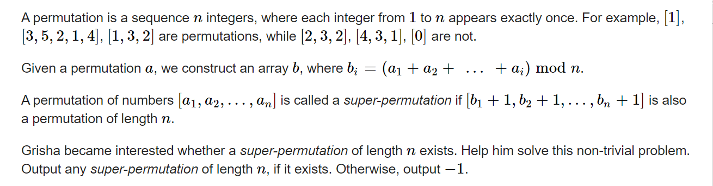

**D. Super-Permutation**
https://codeforces.com/contest/1822/problem/D



#### solve

 分类讨论：

1. 奇数的解存在情况：
   1. 1显然有解
   2. 其余奇数无解。容易证明， 至少有两个位置的前缀和是  n 的倍数。
2. 偶数的情况
   1. 初始 n  n - 1 . 然后奇数 ， 偶数分类。详细处理看下代码。一种左右对称构造的想法。

#### code

```cpp
void work(int testNo)
{
	int n;
	cin >> n;
	if (n == 1) {
		cout << 1 << "\n";
		return;
	}
	if (n % 2) {
		cout << -1 << "\n";
		return;
	}
	ans[1] = n;
	ans[2] = n - 1;
	for (int i = 3; i <= n; i++) {
		if (i % 2) ans[i] = n + 1 - ans[i - 1];
		else ans[i] = n - 1 - ans[i - 1];
	}
	for (int i = 1; i <= n; i++)
		cout << ans[i] << " \n"[i == n];
}
```

