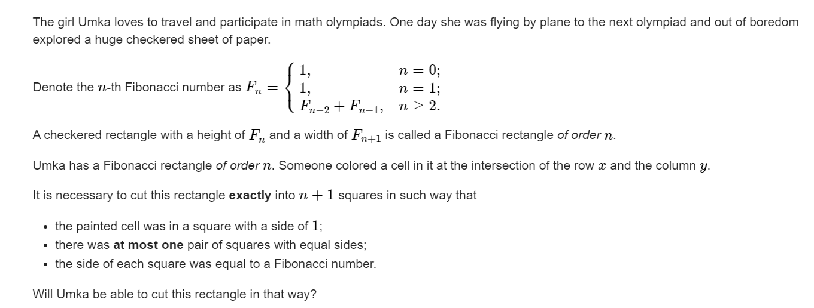
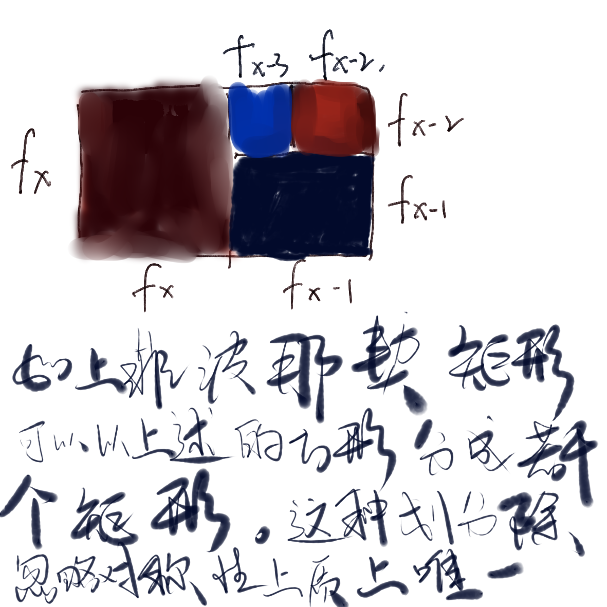

**D. Umka and a Long Flight**

https://codeforces.com/contest/1811/problem/D



 #### solve

**涉及概念：**

1. 斐波那契矩形： 如上。

**涉及操作**：

1. 染色1*1大小方块。
2. 切割矩形为若干个正方形。（每个尺寸的正方形只能出现一次。）





检查是否可以通过上述形式 ， 分割矩形：
方法贪心的将大的一块正方形分离出去，然后递归成分割更小地斐波那契矩形。用同一种策略递归看最后是否分成2*1地矩形。

递归模拟分割：

#### 递归代码如下：

这份代码实现细节比较高超。对坐标使用投影 ， 变换方便处理。

```cpp
#include<bits/stdc++.h>
using namespace std;
typedef long long ll;

const int oo = 0x0fffffff;
const int N = 1E6 + 10;

ll f[50];

string check(ll n , ll x , ll y) {
	if (x == 1 && y == 1)return "YES\n";
	if (y <= f[n] && y > f[n - 1])return "NO\n";
	if (y > f[n]) y -= f[n];
	return check(n - 1 , y , x);
}
void work(int testNo) {
	ll n , x , y;
	cin >> n >> x >> y;
	cout << check(n , x , y);
}
int main()
{
	ios::sync_with_stdio(false);
	cin.tie(0);
	f[0] = f[1] = 1;
	for (int i = 2; i <= 45; i++) {
		f[i] = f[i - 1] + f[i - 2];
	}
	int t; cin >> t;
	for (int i = 1; i <= t; i++)work(i);
}

/* stuff you should look for
* int overflow, array bounds
* special cases (n=1?)
* do smth instead of nothing and stay organized
* WRITE STUFF DOWN
* DON'T GET STUCK ON ONE APPROACH
*/
```


