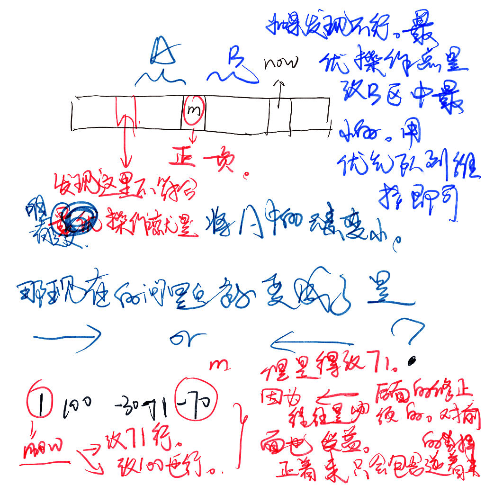

https://codeforces.com/contest/1779/problem/C

给定一个数组，进行一些操作。对数组中的元素取反。

使得所有的前缀和都小于等于 sum(m)。

找出最小操作数。


策略

对于m后后面的数字。

假设处在某一些状态之下。进行操作可以选出最优策略。

研究其对其他操作的影响。发现也是最优策略。争取让自己加的够多，减的也够多。

```cpp
#include <bits/stdc++.h>
using namespace std;
typedef long long ll;
const int maxn = 2e5 + 10;
ll a[maxn];
ll sum[maxn];
void solve()
{
    int n, m;
    cin >> n >> m;
    for (int i = 1; i <= n; i++)
        cin >> a[i];
    int ans = 0;
    priority_queue<pair<ll, int>> que;
    if (a[m] > 0 && m != 1)
    {
        ans++;
        a[m] = -a[m];
    }
    for (int i = 1; i <= m; i++)
    {
        // que.push({a[i], i});
        sum[i] = sum[i - 1] + a[i];
    }
    int res = 0;
    for (int i = m - 1; i >= 1; --i)
    {
        while (sum[i] < sum[m])
        {
            auto j = que.top();
            que.pop();
            ++ans;
            sum[m] -= 2 * j.first;
        }
        que.push({a[i], i});
    }
    while (que.empty() == false)
        que.pop();
    for (int i = m + 1; i <= n; i++)
    {
        que.push({-a[i], i});
        sum[i] = sum[i - 1] + a[i];
        if (sum[i] < sum[m])
        {
            while (sum[m] > sum[i])
            {
                auto t = que.top();
                que.pop();
                ans++;
                sum[i] += 2 * t.first;
            }
        }
    }
    cout << ans << '\n';
}
int main()
{
    ios::sync_with_stdio(false);
    cin.tie(nullptr), cout.tie(nullptr);
    int t;
    cin >> t;
    while (t--)
        solve();
}
```


##### 生长思考

在严格证明之前，不要过于相信自己的结论。一味的去想wa是因为出现了实现bug

