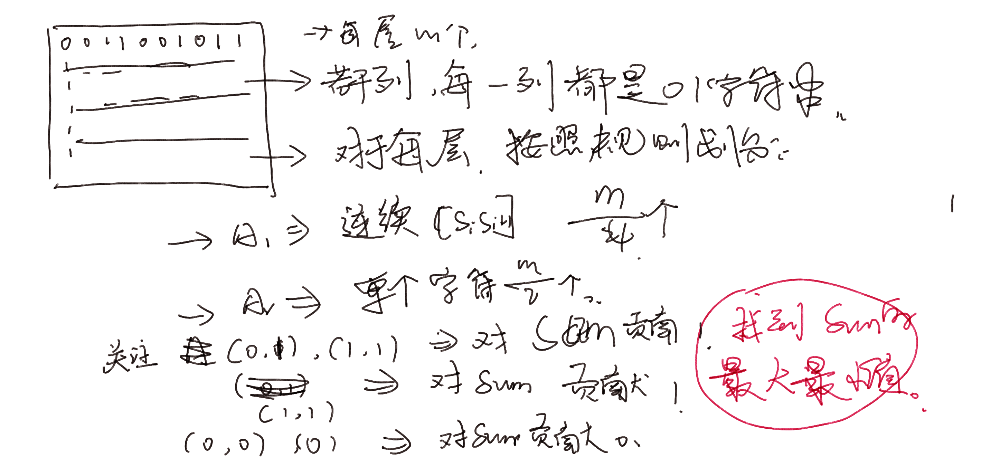

**D. Accommodation**

[Problem - D - Codeforces](https://codeforces.com/contest/1804/problem/D)

**简介**




还是看看题目好：

#### solve:

首先关注到对于每一行的处理都是独立的，因此独立处理即可。

先定义一些变量：（针对每一行的变量：）

$S$:  1的个数。
$A_{0}$(0 , 0)的个数。
$A_{1}$ (1 , 0 ) (1 , 0)的个数。
$A_{2}$（1 ， 1）的个数；
$B_{0}$(0)的个数。
$B_{1}$（0）的个数：


推演如下：
$$
S = A_{1}+A_{2}\times 2+ B_{1}.\\
sum = A_{1} + A_{2} + B_{1}\\
sum = S - A_{2}
$$

因此问题就转变成了就是最大化，最小化$A_2$

对于这种最优问题，可以有一种贪心策略。

1. 最大化

   1. 关注连续的1...1段。
   2. 能选就选.

2. 最小化：

   1. 优先选择（0 ， 0）， （0 ， 1）即可。

   上述可以使用dp来完成： 

#### code

```cpp
#include<bits/stdc++.h>
using namespace std;
using ll = long long;

const int N = 1E6 + 10;
char s[N];

int main()
{
	ios::sync_with_stdio(false);
	cin.tie(0);
	int n , m; cin >> n >> m;
	int mi = 0 , mx = 0;
	for (int i = 0; i < n; i++) {
		cin >> (s + 1);
		vector<int>dp(m  + 1, 0) , dp1(m + 1, 0);
		int sum = 0;
		for (int j = 1; j <= m; j++) {
			sum += s[j] == '1';
			if (j >= 2) {
				dp[j] = max(dp[j - 1] , dp[j - 2] + (s[j] == '1' && s[j - 1] == '1'));
				dp1[j] = max(dp1[j - 1] , dp1[j - 2] + (s[j] == '0' || s[j - 1] == '0'));
			}
		}
		mi += sum - min(m / 4 , dp[m]);
		mx += sum - max(0 , m / 4 - dp1[m]);
	}
	cout << mi << ' ' << mx << '\n';
}
```


