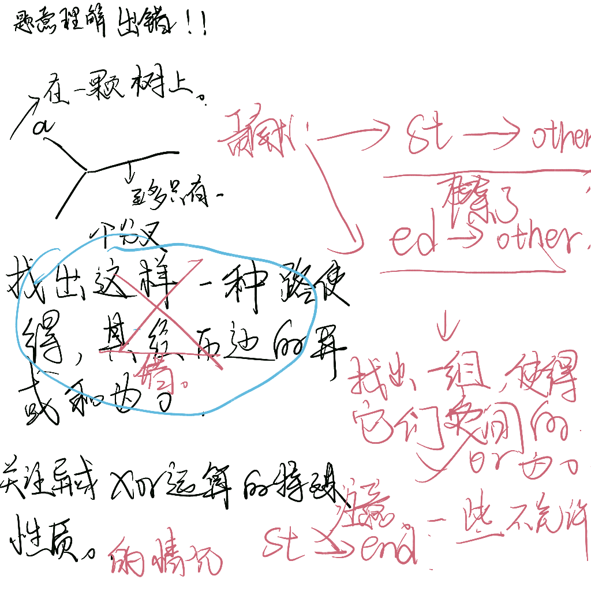

https://codeforces.com/contest/1760/problem/G

#### 题意内容：

```txt
```



#### 思路

- 找到两条路径上的异或和相等即可。
- 进行两个方向上的树上搜索遍历。由于是树，所以两点之间只有一条路。
- 先st--->other(注意end不能被包括在其中。)
- 再ed--->other
- 开一个set维护即可。

---------

```cpp
#include <iostream>
#include <vector>
#include <set>;
using namespace std;
typedef pair<int, int> iip;
int n, st, ed;
vector<vector<iip>> g;
int ans;
set<int> rec;
bool ok;
void dfsa(int now, int fa)
{
    for (int i = 0; i < g[now].size(); i++)
    {
        if (g[now][i].first != fa && g[now][i].first != ed)
        {
            ans ^= g[now][i].second;
            rec.emplace(ans);
            dfsa(g[now][i].first, now);
            ans ^= g[now][i].second;
        }
    }
}

void dfsb(int now, int fa)
{
    for (int i = 0; i < g[now].size(); i++)
    {
        if (g[now][i].first != fa)
        {
            ans ^= g[now][i].second;
            if (rec.count(ans))
            {
                ok = true;
                return;
            }
            dfsb(g[now][i].first, now);
            ans ^= g[now][i].second;
        }
    }
}
void solve()
{
    cin >> n >> st >> ed;
    st--, ed--;
    g.resize(n);
    for (int i = 1; i < n; i++)
    {
        int x, y, z;
        cin >> x >> y >> z;
        x--, y--;
        g[x].push_back({y, z});
        g[y].push_back({x, z});
    }
    ans = 0;
    rec.emplace(0);
    dfsa(st, -1);
    ok = false;
    dfsb(ed, -1);
    if (ok)
        cout << "YES\n";
    else
        cout << "NO\n";
    g.clear();
    rec.clear();
}
int main()
{
    ios::sync_with_stdio(false);
    cin.tie(0), cout.tie(0);
    int t;
    cin >> t;
    while (t--)
        solve();
}
```


