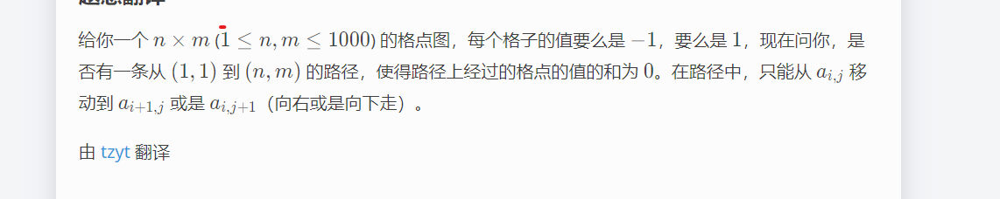

**1695C - Zero Path**

[Problem - 1695C - Codeforces](https://codeforces.com/problemset/problem/1695/C)



#### solve

1. **模型性质挖掘**
   显然如果（n + m）%2 == 0必然无解。
   关注路径的最大和，以及最小和。有如下发现：
   通过一种解，进行迁移，研究其它解；
   发现最小的路径可以逐步交换到最大路径：具体交换规则如下：
   1. LD -》 DL. 或者反之。
   1. 每次交换路径总和发生的变化有三种情况分别为0 -2 , 2.
   
   由于偶数和个+1 -1相加最终的结果必然是偶数。所以从最大到最小的过程中，必然会经历0的情况。
   
   因此问题转变成了求最大路径和 ， 最大路径的简单dp问题。
   
   ```cpp
   #include<bits/stdc++.h>
   using namespace std;
   typedef long long ll;
   
   const int oo = 0x0fffffff;
   const int N = 1E3 + 10;
   
   int a[N][N];
   
   int mx[N][N];
   int mi[N][N];
   
   void work(int testNo)
   {
   	int n , m;
   	cin >> n >> m;
   
   	for (int i = 1; i <= n; i++)
   		for (int j = 1; j <= m; j++) {
   			cin >> a[i][j];
   			if (j == 1) {
   				mx[i][j] = mx[i - 1][j];
   				mi[i][j] = mi[i - 1][j];
   			}
   			else if (i == 1) {
   				mx[i][j] = mx[i][j - 1];
   				mi[i][j] = mi[i][j - 1];
   			} else {
   				mx[i][j] = max(mx[i - 1][j] , mx[i][j - 1]);
   				mi[i][j] = min(mi[i - 1][j] , mi[i][j - 1]);
   			}
   			mx[i][j] += a[i][j];
   			mi[i][j] += a[i][j];
   		}
   	if ((n + m) % 2 == 0) {
   		cout << "NO\n";
   		return;
   	}
   	if (mx[n][m] >= 0 && mi[n][m] <= 0) {
   		cout << "YES\n";
   	} else cout << "NO\n";
   }
   
   
   int main()
   {
   	ios::sync_with_stdio(false);
   	cin.tie(0);
   
   	int t; cin >> t;
   	for (int i = 1; i <= t; i++)work(i);
   }
   
   /* stuff you should look for
   * int overflow, array bounds
   * special cases (n=1?)
   * do smth instead of nothing and stay organized
   * WRITE STUFF DOWN
   * DON'T GET STUCK ON ONE APPROACH
   */
   
   ```
   
   **另外一种很暴力的思路**
   
   最暴力的dp方案
   
   **状态：**
   
   $dp_{i , j ,k}$表示到i ， j 格子和为k的方案是否存在。
   
   **转移：**
   
   `if(a[i][j] == 1)`
   
   $dp_{i, j , k} = dp_{i - 1 , j , k -1}|dp_{i , j -1 , k -1}$
   
   `else`
   
   $dp_{i , j ,k} = dp_{i-1, j,k}|dp_{i,j -1 , k}$
   
   **复杂度是：$10^9$**
   
   使用bitset除上w刚刚好。
   
   #### 具体优化
   
   **状态**
   
   依然如上。
   
   **转移**
   
   直接做或运算即可。
   
   1. 如果a\[i][j]为0.dp数组保持不变。
   2. 如果a\[i][j]为1，dp数组左移动一位。
   
   ```cpp
   #include<bits/stdc++.h>
   using namespace std;
   typedef long long ll;
   
   const int oo = 0x0fffffff;
   const int N = 1E3 + 10;
   int a[N][N];
   int mx[N][N];
   int mi[N][N];
   void work(int testNo)
   {
   	int n , m;
   	cin >> n >> m;
   
   	for (int i = 1; i <= n; i++)
   		for (int j = 1; j <= m; j++) {
   			cin >> a[i][j];
   			if (j == 1) {
   				mx[i][j] = mx[i - 1][j];
   				mi[i][j] = mi[i - 1][j];
   			}
   			else if (i == 1) {
   				mx[i][j] = mx[i][j - 1];
   				mi[i][j] = mi[i][j - 1];
   			} else {
   				mx[i][j] = max(mx[i - 1][j] , mx[i][j - 1]);
   				mi[i][j] = min(mi[i - 1][j] , mi[i][j - 1]);
   			}
   			mx[i][j] += a[i][j];
   			mi[i][j] += a[i][j];
   		}
   	if ((n + m) % 2 == 0) {
   		cout << "NO\n";
   		return;
   	}
   	if (mx[n][m] >= 0 && mi[n][m] <= 0) {
   		cout << "YES\n";
   	} else cout << "NO\n";
   }
   int main()
   {
   	ios::sync_with_stdio(false);
   	cin.tie(0);
   
   	int t; cin >> t;
   	for (int i = 1; i <= t; i++)work(i);
   }
   ```