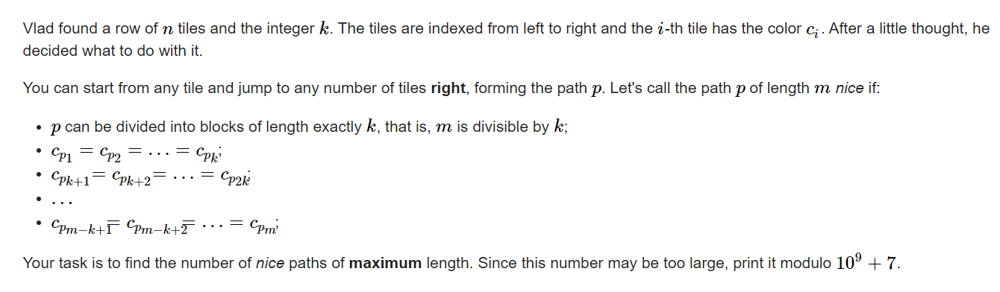

**G2. Vlad and the Nice Paths (hard version)**

https://codeforces.com/contest/1811/problem/G2



#### solve

动态规划：

**状态定义：**

$f_i$表示以i为结尾的 ， 符合条件的长度最长序列的个数。

**状态转移：**

$f_j * C(区间内c[i]颜色的个数 , k - 1)->f_i$

**初始化：**

$f_{0}= {1 ，0}$ 一个状态要记录两个量。

#### code

```cpp
#include<bits/stdc++.h>
using namespace std;
typedef long long ll;

const int oo = 0x0fffffff;
const int mod = 1E9 + 7;
const int N = 5E3 + 10;
const int N_c = 5E3 + 10;
int c[N_c][N_c];
void C_init() {
	c[0][0] = 1;
	for (int i = 1; i < N_c; ++i) {
		c[i][0] = c[i][i] = 1;
		for (int j = 1; j < i; ++j) {
			c[i][j] = (c[i - 1][j] + c[i - 1][j - 1]) % mod;
		}
	}
}

struct node {
	ll s;
	ll l;
} f[N];
int a[N];
int sum[N][N];
void work(int testNo) {
	int n, k;
	cin >> n >> k;
	for (int i = 1; i <= n; i++)
		for (int j = 1; j <= n; j++)
			sum[i][j] = 0;
	for (int i = 1; i <= n; i++) {
		cin >> a[i];
		sum[i][a[i]] = 1;
		f[i] = { 0 , 0 };
	}
	for (int i = 1; i <= n; i++) {
		for (int j = 1; j <= n; j++) {
			sum[j][i] += sum[j - 1][i];
		}
	}
	f[0] = { 1 , 0 };
	ll x = 0, y = 0;
	for (int i = 1; i <= n; i++) {
		for (int j = 0; j < i; j++) {
			if (sum[i][a[i]] - sum[j][a[i]] < k || f[j].l + 1 < f[i].l) {
				continue;
			}
			if (f[j].l + 1 == f[i].l) {
				f[i].s = (f[i].s + f[j].s * c[sum[i - 1][a[i]] - sum[j][a[i]]][k - 1] % mod) % mod;
			}
			else {
				f[i].s = f[j].s * c[sum[i - 1][a[i]] - sum[j][a[i]]][k - 1] % mod;
				f[i].l = f[j].l + 1;
			}
		}
		x = max(x, f[i].l);
	}
	// cout << "test  " << testNo << '\n';
	// cout << "x" << x << '\n';
	for (int i = 0; i <= n; i++) {
		//cout << f[i].s << " \n"[i == n];
		if (f[i].l == x) {
			y = (y + f[i].s) % mod;
		}
	}
	cout << y << '\n';
}
int main()
{
	ios::sync_with_stdio(false);
	cin.tie(0);
	C_init();
	int t; cin >> t;
	for (int i = 1; i <= t; i++)work(i);
}
```


