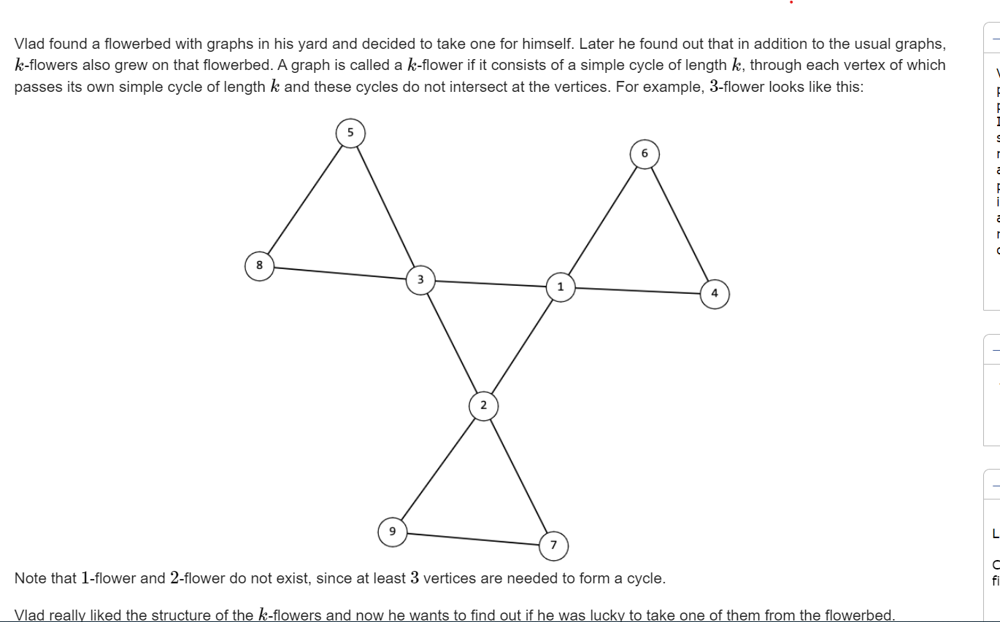
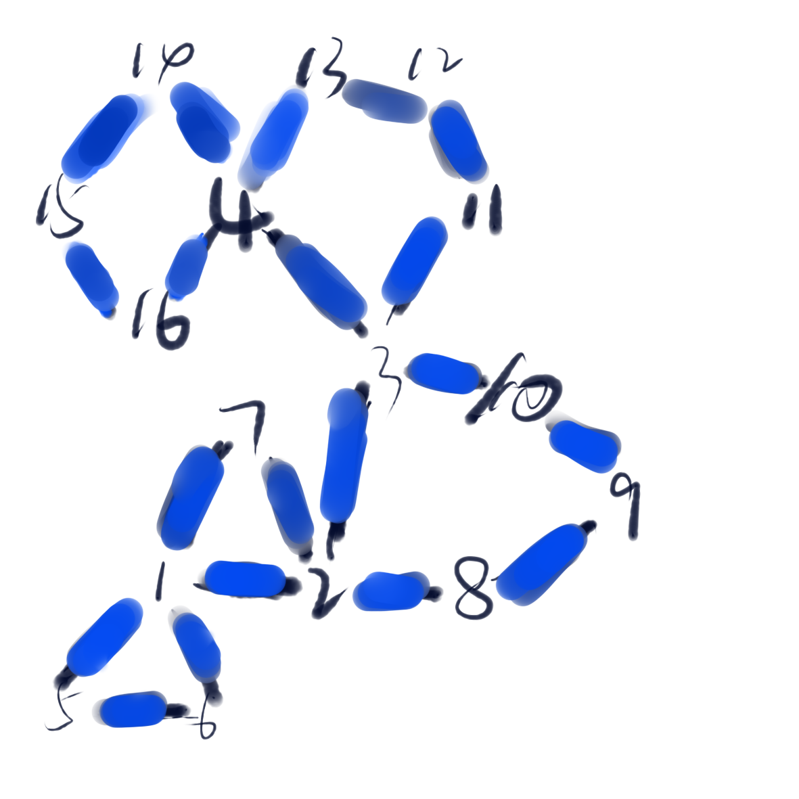

**F. Is It Flower?**




#### 简介：

判断图是否为一个长度为k的简单环， 且每个点上都接着一个长度为k的环。这些环之之间不相交。如上图形式：

#### solve

判断有没有环：

1. 点的个数上：
   $$
   k + k*(k - 1) = n\\
   k^2 = n\\
   k = \sqrt n
   $$
   为正整数

2. 点的度数上：

   1. 有k割个点的度数为4
   2. 这k个点要形成一个环。

3. 其余点度数为2 ， 并且平分成k份。

   这个不大对有可能会被hack。必须保证这k份同时成一个圈。简单的判断会被hack.

   ```txt
   16 20
   1 2
   1 5
   1 6
   1 7
   2 3
   2 7
   2 8
   3 10
   3 11
   3 4
   4 13
   4 14
   4 15
   5 6
   8 9
   9 10
   11 12
   12 13
   14 16
   15 16
   
   NO
   ```

   



1. 找出一些条件：
   1. 每一组中的点只能其首部尾部只能遇见一种四度的点。


上述算法大模拟实现即可。

 [E. Routing.md](..\..\..\2000\图论\E. Routing.md) （这个也是涉及到了环结构比较比较）。

#### code

```cpp
#include<bits/stdc++.h>
using namespace std;
typedef long long ll;

const int oo = 0x0fffffff;
const int N = 1E6 + 10;

vector<vector<int>> g;
vector<int>deg;
int  n , m , k;
void work(int testNo)
{
	bool f = true;
	cin  >> n >> m;
	g = vector<vector<int>>(n);
	deg = vector<int>(n , 0);
	for (int i = 0; i < m; i++) {
		int x , y;
		cin >> x >> y;
		x-- , y--;
		g[x].push_back(y);
		g[y].push_back(x);
		deg[x]++; deg[y]++;
	}
	k = sqrt(n);
	int st = 0;
	if (k * k != n)f = false;
	int sum4 = 0;
	for (int i = 0; i < n; i++) {
		if (deg[i] == 4) {
			st = i;
			sum4 ++;
		} else if (deg[i] != 2) {
			f = false;
		}
	}
	if (sum4 != k) f = false;
	//检查是否成圈。
	vector<bool> vis(n , false);
	function< bool (int)> check = [&](int x) {
		return deg[x] == 4 && vis[x] == false;
	};
	int sum = 0;
	set<int> rec4;
	function<void(int)> dfs = [&](int u) {
		vis[u] = true;
		sum++;
		for (auto v : g[u]) {
			if (check(v)) {
				dfs(v);
			}
			if (deg[u] == 2 && deg[v] == 4)rec4.insert(v);
		}
		vis[u] = true;
	};
	dfs(st);
//	cout << sum << '\n';
	if (sum != k) f = false;
	check = [&](int x) {
		return deg[x] == 2 && vis[x] == false;
	};
	for (int i = 0; i < n; i++) {
		if (deg[i] == 4) {
			st = i;
			sum = 0;
			rec4.clear();
			dfs(i);
			//cout << rec4.size() << '\n';
			if (sum != k || rec4.size() != 1)f = false;
		}
	}
	if (f) cout << "YES\n";
	else cout << "NO\n";
}

int main()
{
	ios::sync_with_stdio(false);
	cin.tie(0);

	int t; cin >> t;
	for (int i = 1; i <= t; i++)work(i);
}
```


​      