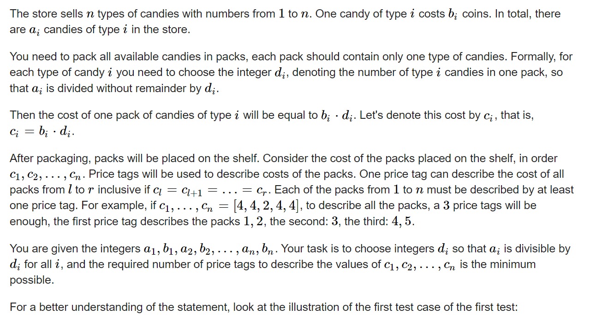
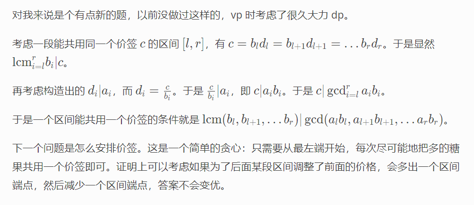

**C. Candy Store**
https://codeforces.com/contest/1798/problem/C



#### 20mins

?? 子问题：

1. 相当于一个分组问题： 对于一个数， 怎么确定同组元素？

   1. 能选就选？
      1. ？？ 不知道：该结论正确情况：
         1. 手推： ？？
         2. 纯逻辑推导：？？
   2. 如果允许 ， 尽量往小了选。（这个是显然的 ， 因为这样遇到了更小的数字时 ，可以获得更多的选择。）

2. 两个数可以经过因数的选取 ， 归于同一个标签的技巧是什么？

   1. 从因数的角度上看：

$$
对于数组: i， j都有\\
a_i \% lcm(b_i , b_j)=0\\
a_j\% lcm(b_i , b_j)=0
$$

读假题啦！！这里的区间是可以连续的。
所以只需要集中精力解决： 最长连续可用作同一个区间的问题即可。

#### solve

角度就是从最左端开始 ， 能选就选。
抄大哥的博客：



[【CF1798C】Candy Store - 一扶苏一 的博客 - 洛谷博客 (luogu.com.cn)](https://www.luogu.com.cn/blog/fusu2333/solution-cf1798c)

```cpp
#include<bits/stdc++.h>
using namespace std;
typedef long long ll;
const int oo = 0x0fffffff;
const int N = 1E6 + 10;
ll a[N], b[N];
ll gcd(ll x, ll y) {
	return y == 0 ? x : gcd(y, x % y);
}
ll lcm(ll x, ll y) {
	return x * y / gcd(x, y);
}
void work(int testNo)
{
	int n;
	cin >> n;
	for (int i = 1; i <= n; i++)
		cin >> a[i] >> b[i];
	int ans = 0;
	for (int i = 1; i <= n; i++) {
		ans++;
		ll x = a[i] * b[i], y = b[i];
		for (int j = i + 1; j <= n; j++) {
			x = gcd(x, a[j] * b[j]);
			y = lcm(y, b[j]);
			if (x % y) {
				i = j - 1;
				break;
			}
			if (j == n) {
				i = j;
				break;
			}
		}
	}
	cout << ans << "\n";
}
int main()
{
	ios::sync_with_stdio(false);
	cin.tie(0);

	int t; cin >> t;
	for (int i = 1; i <= t; i++)work(i);
}
/* stuff you should look for
* int overflow, array bounds
* special cases (n=1?)
* do smth instead of nothing and stay organized
* WRITE STUFF DOWN
* DON'T GET STUCK ON ONE APPROACH
*/
```
