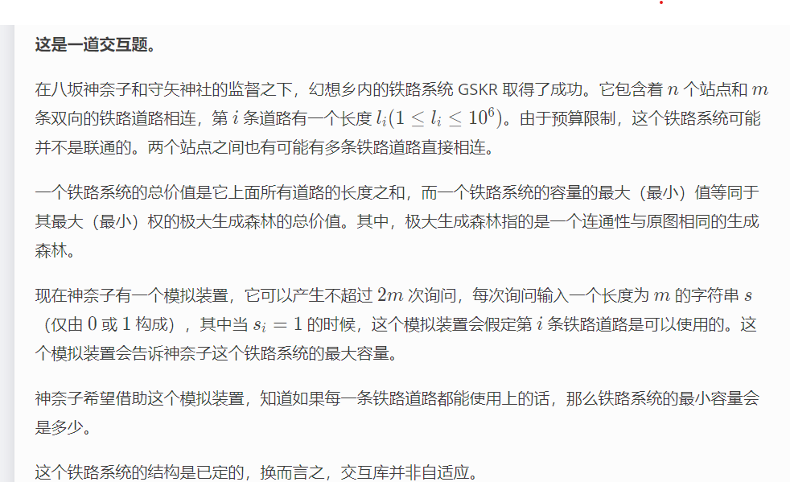

https://codeforces.com/problemset/problem/1687/B

B. Railway System



#### solve

1. 2m次询问限制意味着什么？
2. 怎么挖掘2m的价值 ， 得到每一条边的长度？
3. 怎么联系到krusal定理？


**得到每一条边的长度：**
1. 特殊的 ， 00000100000这种形式， 可以得到一条边的长度。

**联系kruskal的关键**

1. 逐渐添加边的过程中 ， 判断是否已经属于一个连通块。应该关注什么信息？
   1. 如果添加一条边， 使得变化情况不为当前边的边长 ，说明改变已经替代了之前的一条边。所以当前边不可选。

#### code

```cpp
#include<bits/stdc++.h>
using namespace std;
using ll = long long;

const int N = 1E6 + 10;
int q[N] , len[N];
int n , m;
int query() {
	cout << "? ";
	for (int i = 1; i <= m; i++) {
		cout << q[i];
	}
	cout << endl;
	int x; cin >> x;
	return x;
}
int main()
{
	ios::sync_with_stdio(false);
	cin.tie(0);
	cin >> n >> m;
	for (int i = 1; i <= m; i++) {
		cout << "? ";
		for (int j = 1; j <= m; j++)
			if (j == i)cout << 1;
			else cout << 0;
		cout << endl;
		cin >> len[i];
	}
	vector<int>id(m , 0);
	iota(id.begin() , id.end() , 1);
	sort(id.begin() , id.end() , [&](int x , int y) {
		return len[x] < len[y];
	});
	int pre = 0;
	for (int i = 0; i < m; i++) {
		q[id[i]] = 1;
		if (query() - pre == len[id[i]]) {
			pre += len[id[i]];
		} else q[id[i]] = 0;
	}
	cout << "! " << pre << endl;
}
```


