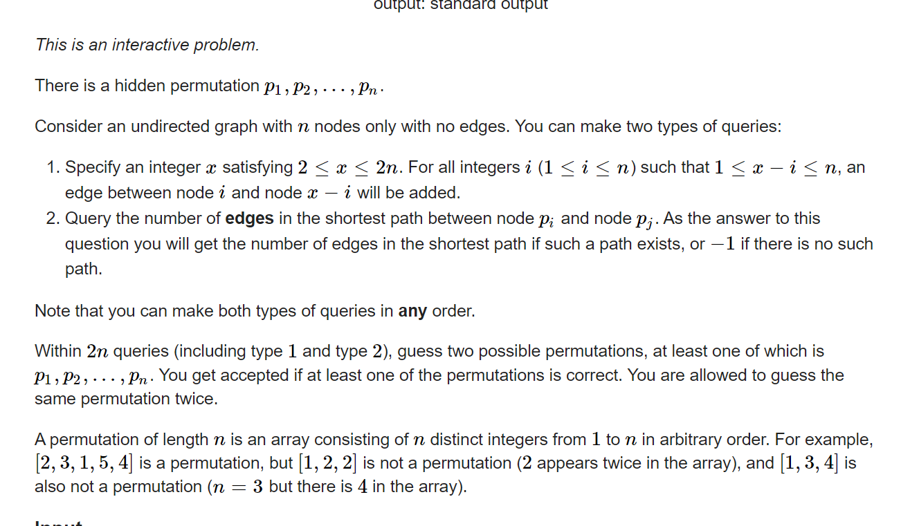

**D. Sum Graph**
https://codeforces.com/contest/1816/problem/D



非常阴间的交互背景。

#### solve

首先构造出一个特殊的图。并且是从两点之间距离出发的。

**显然是将图变成一条有规律的单链：**

两次操作如下：

1.  `?   n + 2`
2. `?    n + 1`

然后图就会转变成一种非常具有特殊性的图： 
1 n 2 n -1 .....

然后找到一个端点 ， 逐步确定么每一个元素距离端点的距离。最后分类讨论关注的断电在哪一端即可。

1. 找到端点, 枚举任意一个元素作为中间值， 逐步询问，显然距离最长是端点。
2. 找到其余元素离端点的距离 ， 同样逐步询问即可。
3. 然后先枚举当前端点的值， 然后确认距离 ， 从而整理出两种可能的排列。

==注意交互要求和普通的交互不一致：每次输出两种 ？ ！ 操作后都要接受一个反馈信息==

#### code

```cpp
#include<bits/stdc++.h>
using namespace std;
typedef long long ll;
const int oo = 0x0fffffff;
const int N = 1E6 + 10;
int ans[N];
int order[N];
int xd;
void work(int testNo)
{
	int n;
	cin >> n;
	cout << "+ " << n + 1 << endl;
	cin >> xd;
	cout << "+ " << n + 2 << endl;
	cin >> xd;
	int mx = 0, j = 1;
	for (int i = 2; i <= n; i++) {
		cout << "? " << 1 << " " << i << endl;
		int rp; cin >> rp;
		if (rp > mx) {
			j = i ;
			mx = rp;
		}
	}
	//j是两端中的一个，
	//1 , n , 2 , n  - 2 ........这样的排列方法。
	for (int i = 1 , k = 1; i <= n; i += 2 , k++) {
		ans[i] = k;
	}
	for (int i = 2 , k = n; i <= n; i += 2 , k--) {
		ans[i] = k;
	}
	order[j] = 0;
	for (int i = 1; i <= n; i++) {
		if (i != j) {
			cout << "? " << j << " " << i << endl;
			int pos;
			cin >> pos;
			order[i] = pos;
		}
	}
	cout << "!";
	for (int i = 1; i <= n; i++) {
		cout << " " << ans[order[i] + 1];
	}
	for (int i = 1; i <= n; i++) {
		cout << " " << ans[n - order[i]];
	}
	cout << endl;
	cin >> xd;
}
int main(){
	int t; cin >> t;
	for (int i = 1; i <= t; i++)work(i);
}
/* stuff you should look for
* int overflow, array bounds
* special cases (n=1?)
* do smth instead of nothing and stay organized
* WRITE STUFF DOWN
* DON'T GET STUCK ON ONE APPROACH
*/
```