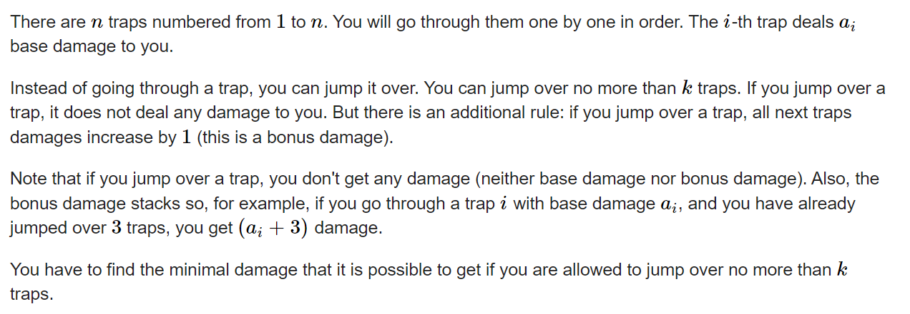
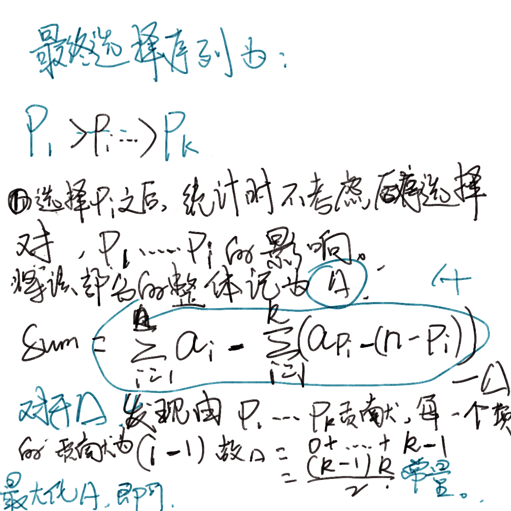

### **D. Traps**

https://codeforces.com/contest/1684/problem/D




#### 题目简介：

经过n个陷阱 ， 每一个陷阱有伤害属性。在该过程中，有k次机会选择是否避开当前面对的陷阱。每一次避开会产生一定的后效性：问怎么选择使得最后产生的伤害最小。

#### solve

从某一个角度来看 ， 选择跳过陷阱 i 之后 ， j 陷阱带来的伤害整体上会增加 n - i 。 总体上避开伤害为*$a_i - (n - i)$*; 每一个陷阱拓展出当前属性。*$b_{i} = a_{i} - (n - i)$*然后优先选取较大的方案：

**证明**
显然k次数用完是最优的选择。

证明如下：




```cpp
#include<bits/stdc++.h>
using namespace std;
typedef long long ll;

const int oo = 0x0fffffff;
const int N = 1E6 + 10;

int a[N];
void work(int testNo)
{
	int n  , k; cin >> n >> k;
	ll ans = 0;
	for (int i = 0; i < n; i++) {
		cin >> a[i];
		ans += a[i];
		a[i] = a[i] - (n - i - 1);
	}
	sort(a  , a  + n , greater<int>());
	for (int i = 0; i < k; i++) {
		ans -= a[i];
	}
	ans -= 1LL * k * (k - 1) / 2;
	cout << ans << '\n';
}


int main()
{
	ios::sync_with_stdio(false);
	cin.tie(0);

	int t; cin >> t;
	for (int i = 1; i <= t; i++)work(i);
}
```