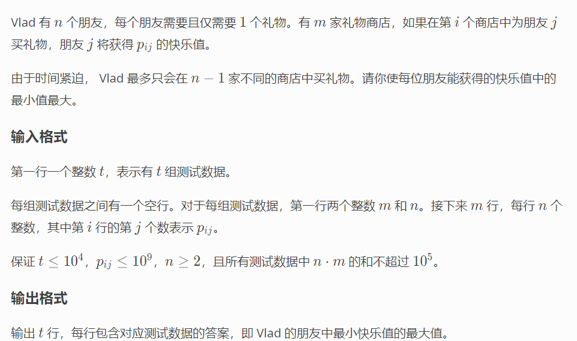

**D. New Year's Problem**
https://codeforces.com/contest/1619/problem/D



#### solve

最大化最小值： 显然是二分：
考虑怎么check一个值x , 是否有更优的解：关注下角度：
1. 每一个人至少对应一个商品比该值大.
1. 存在一个商店,满足有两个以上的人可以在其中找到对应的商品。

#### code

```cpp
#include<bits/stdc++.h>
using namespace std;

// 加油！！！
vector<vector<int>> a;
void solve() {
	int m , n;
	cin >> m >> n;
	a = vector<vector<int>> (m + 1 , vector<int>(n + 1));
	for (int i = 1; i <= m; i++)
		for (int j = 1; j <= n; j++)
			cin >> a[i][j];
	function<bool(int x)> check = [&](int x)->bool{
		int flag = 0;
		//首先检查。对于每一个人，都可以找到喜欢的商品价值大于等于该值。
		int cunt = 0;
		for (int i = 1; i <= n; i++) {
			bool have = false;
			for (int j = 1; j <= m; j++) {
				if (a[j][i] >= x) have = true;
			}
			cunt += have;
		}
		flag |= cunt == n;
		for (int i = 1; i <= m; i++) {
			int cunt = 0;
			for (int j = 1; j <= n; j++) {
				cunt += a[i][j] >= x;
			}
			flag |= (cunt >= 2) << 1;
		}
		return flag == 3;
	};
	int low = 0 , high = (int)1E9;
	while (low < high) {
		int mid = (low + high + 1) / 2;
		if (check(mid)) low = mid;
		else high = mid - 1;
	}
	cout << low << "\n";
}

int main() {
	ios::sync_with_stdio(false);
	cin.tie(0);
	int t; cin >> t;
	while (t--)solve();
}
```