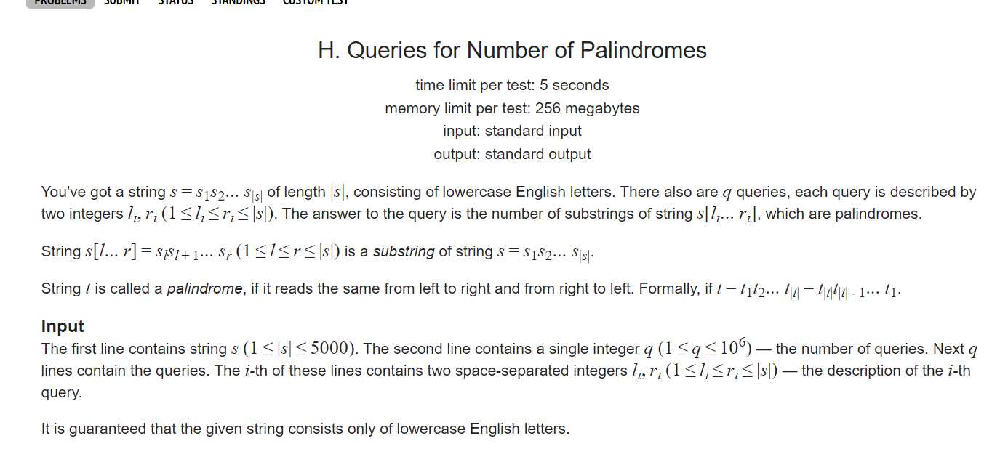

**H. Queries for Number of Palindromes**
https://codeforces.com/problemset/problem/245/H




#### solve

1. 范围比较小： 考虑区间信息记录： 区间内的回文串个数： 并不好处理由于新入端点： 探究这个点带来的影响 ， 就要探究其串内部的结构情况。

正解： 

**状态设计**

$f_{l , r}$区间l   ,  r 这一段子串是否为一个回文串： 如果是为1  ， 否则为0；

**状态转移方程**

比较简单， 略， 看代码。

**计算答案**

1. 二维前缀和，
2. 求出固定的区间段内的回文串总数。

#### 生长：

1. 这个角度思路 ， 比较陌生 如上就是有两步主要的思维跳跃 ； 归类为： 
   1. 找出有限的贡献元素。（所有的回文串）
   2. 前缀和维护 。

#### code

```cpp
const int inf = 1 << 29;
const ll INF = 1LL << 60;
const int N = 5000 + 10;

int f[N][N];

signed main()
{
	ios::sync_with_stdio(false);
	cin.tie(0);
	string s;
	cin >> s;
	int n = sz(s);
	s = ' ' + s;
	for (int i = 1; i <= n; i++) {
		for (int l = 1; l + i - 1 <= n; l++) {
			int r = l + i - 1;
			if (l == r) {f[l][r] = 1; continue;}
			if (l == r - 1) {f[l][r] = s[l] == s[r]; continue;}
			if (s[l] == s[r]) f[l][r] = f[l + 1][r - 1];
			else f[l][r] = 0;
		}
	}
	// for (int i = 1; i <= n; i++)
	// 	for (int j = 1; j <= n; j++) {
	// 		cout << f[i][j] << " \n"[j == n];
	// 	}
	for (int i = 1; i <= n; i++)
		for (int j = 1; j <= n; j++) {
			f[i][j] += f[i - 1][j] + f[i][j - 1] - f[i - 1][j - 1];
		}
	int t;
	cin >> t;
	while (t -- ) {
		int l , r;
		cin >> l >> r;
		cout << f[r][r] - f[r][l - 1] - f[l - 1][r] + f[l - 1][l - 1] << "\n";
	}
}
```

