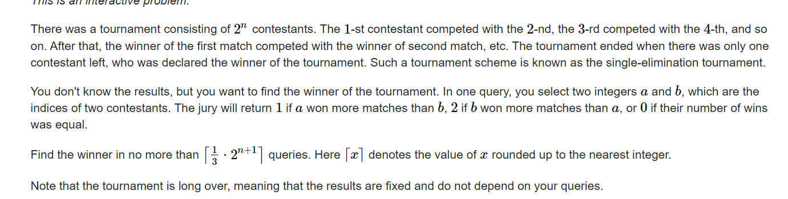

**D. Tournament Countdown**
https://codeforces.com/contest/1713/problem/D



#### solve

询问结果是， 胜场数的多少。而不是简单的数值大小情况。

特殊的性质下， 引出一个性质：

1. 可以通过2次询问筛除3个人。

假设现在剩下4个人： 分别标记为a  ,b ,c d;

**询问（a ,  d）**

1.  ans = 1

   **信息**：a > b

   **next**(a , c)

   ​		1 : a最终赢家

   ​		2  b最终赢家

2. ans = 0

   **信息：** a = b.且两者都是被淘汰者。

   **next:** (c , d);

3. ans = 2;

   同上1.


#### code

```cpp
#include<bits/stdc++.h>
using namespace std;
using ll = long long;
using i64 = long long;
using ull = unsigned long long;
using ld = long double;
using uint = unsigned int;
using pii = pair<int , int>;
using pli = pair<ll , int>;
using pll = pair<ll , ll>;
#define dbg(x) cerr << "[" << __LINE__ << "]" << ": " << x << "\n"
#define all(x) (x).begin(),(x).end()
#define sz(x) (int)(x).size()
#define pb push_back
#define fi first
#define se second
const int inf = 1 << 29;
const ll INF = 1LL << 60;
const int N = 1 << 20;
int a[N] , b[N] , tot;
int query(int x , int y) {
	cout << "? " << x << " " << y << endl;
	int res; cin >> res;
	return res;
}
void work(int testNo)
{
	int n;
	cin >> n;
	const int M = 1 << n;
	tot = M;
	iota(b + 1 , b + 1 + M , 1);
	while (tot >= 4) {
		int cunt = 0;
		for (int i = 1; i <= tot; i += 4) {
			int q = query(b[i] , b[i + 3]);
			if (q == 1) {
				q = query(b[i] , b[i + 2]);
				if (q == 1)a[++cunt] = b[i];
				else a[++cunt] = b[i + 2];
			} else if (q == 0) {
				q = query(b[i + 1] , b[i + 2]);
				if (q == 1) a[++cunt] = b[i + 1];
				else a[++cunt] = b[i + 2];
			} else {
				q = query(b[i + 1] , b[i + 3]);
				if (q == 1)a[++cunt] = b[i + 1];
				else a[++cunt] = b[i + 3];
			}
		}
		tot = cunt;
		for (int i = 1; i <= tot; i++)
			b[i] = a[i];
	}
	if (tot == 2) {
		int q = query(b[1] , b[2]);
		if (q == 1) {
			cout << "! " << b[1] << endl;
		} else cout << "! " << b[2] << endl;
	}
	else cout << "! " << b[1] << endl;
}
signed main()
{
	ios::sync_with_stdio(false);
	cin.tie(0);

	int t; cin >> t;
	for (int i = 1; i <= t; i++)work(i);
}
/* stuff you should look for
* int overflow, array bounds
* special cases (n=1?)
* do smth instead of nothing and stay organized
* WRITE STUFF DOWN
* DON'T GET STUCK ON ONE APPROACH
*/
```


