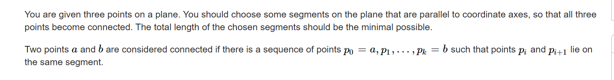

**C. Connect the Points**
https://codeforces.com/contest/1666/problem/C



#### solve

首先只要求线段覆盖路径即可。

这种移动方式： 只能上下左右走：和曼哈顿距离相关：

1. 非常容易的找到一个移动距离的下界。

求轨迹最小：

这里移动距离的下界必然是 $x_{max} - x_{min} + y_{max} - y_{min}$

1. 处理策略：
   1. 对三个点进行一个排序：
   2. 中间点上下界跑满。另外两点接近中间线：
   3. 显然结果就是所有方案的下界。 

然后捉着这个下界构造即可；

#### 生长思考：

1. 问题推广：问题面对的解： 设方案为$x$ ， 方案价值为$f(x)$ 。找最大最小价值解。
   1. 考虑所有的集合 ， 贴着函数值域的上下界构造。

#### code

```cpp
#include<bits/stdc++.h>
using namespace std;

using ll = long long;
using i64 = long long;
using ull = unsigned long long;
using ld = long double;
using uint = unsigned int;
using pii = pair<int , int>;
using pli = pair<ll , int>;
using pll = pair<ll , ll>;


#define dbg(x) cerr << "[" << __LINE__ << "]" << ": " << x << "\n"

#define all(x) (x).begin(),(x).end()
#define sz(x) (int)(x).size()
#define pb push_back
#define fi first
#define se second

const int inf = 1 << 30;
const ll INF = 1LL << 60;
const int N = 1E6 + 10;

// ll x[N] , y[N];
// vector<pll> g(int a , int b , int c) {
// 	vector<pll> res;
// 	res.push_back(make_pair(x[a] , y[a]));
// 	auto t = res.back();
// 	res.push_back(make_pair(t.fi , y[b]));
// 	res.push_back(make_pair(x[b] , y[b]));
// 	t = res.back();
// 	res.push_back(make_pair(t.fi , y[c]));
// 	res.push_back(make_pair(x[c] , y[c]));
// 	return res;
// }
// ll f(vector<pll> t) {
// 	ll res = 0;
// 	for (int i = 1; i < sz(t); i++) {
// 		res += abs(t[i].fi - t[i - 1].fi);
// 		res += abs(t[i].se - t[i - 1].se);
// 	}
// 	return res;
// }
// void update(vector<pll>& ans , vector<pll>& a) {
// 	ans.push_back(a[0]);
// 	ans.push_back(a[1]);
// 	for (int i = 2; i < sz(a); i++) {
// 		if (a[i].fi == ans[sz(ans) - 1].fi && a[i].fi == ans[sz(ans) - 2].fi) {
// 			ans.pop_back();
// 		} else if (a[i].se == ans[sz(ans) - 1].se && a[i].se == ans[sz(ans) - 2].se) {
// 			ans.pop_back();
// 		}
// 		ans.push_back(a[i]);
// 	}
// }

pii node[3];
signed main()
{
	ios::sync_with_stdio(false);
	cin.tie(0);
	for (int i = 0; i < 3; i++)
		cin >> node[i].fi >> node[i].se;
	sort(node , node + 3);
	int mi = inf;
	int mx = -inf;
	// dbg(mx);
	// dbg(mi);
	for (int i = 0; i < 3; i++) {
		mi = min(mi , node[i].se);
		mx = max(mx , node[i].se);
	}
	vector<pair<pii , pii>> ans;
	if (mi != mx) {
		ans.push_back({{node[1].fi , mi} , {node[1].fi , mx}});
	}
	for (int i = 0; i <= 2; i += 2) {
		if (node[i].fi != node[1].fi) ans.push_back({{node[i].fi , node[i].se} , {node[1].fi , node[i].se}});
	}
	cout << sz(ans) << "\n";
	for (auto t : ans) {
		cout << t.fi.fi << " " << t.fi.se << " " << t.se.fi << " " << t.se.se << "\n";
	}
}

/* stuff you should look for
* int overflow, array bounds
* special cases (n=1?)
* do smth instead of nothing and stay organized
* WRITE STUFF DOWN
* DON'T GET STUCK ON ONE APPROACH
*/
```

