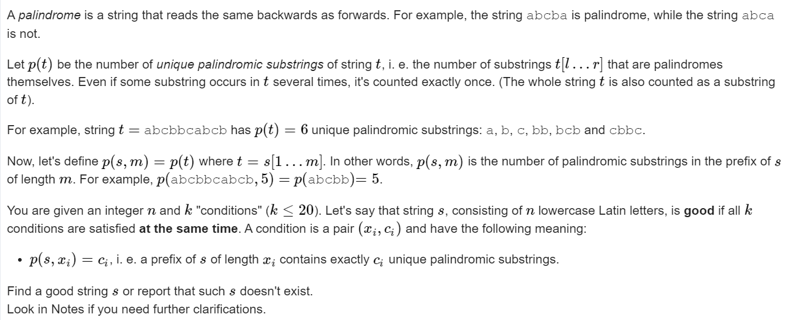

**D. Unique Palindromes**
https://codeforces.com/contest/1823/problem/D



#### solve

首先注意到：

1. 长度为n的字符串中 ， 本质不同的回文子串最多有n个。

2. 增加字符串的过程中， 可以控制回文串的种数增加0或1.
3. 对于每一个段， 可以分段构造贡献：

对每一段贡献为了防止前后产生干扰：

1. 使用循环串选择段落尾： abcabc..........

#### code

```cpp
#include<bits/stdc++.h>
using namespace std;

using ll = long long;
using i64 = long long;
using ull = unsigned long long;
using ld = long double;
using uint = unsigned int;
using pii = pair<int, int>;
using pli = pair<ll, int>;
using pll = pair<ll, ll>;


#define dbg(x) cerr << "[" << __LINE__ << "]" << ": " << x << "\n"

#define all(x) (x).begin(),(x).end()
#define sz(x) (int)(x).size()
#define pb push_back
#define fi first
#define se second

const int inf = 1 << 29;
const ll INF = 1LL << 60;
const int N = 1E6 + 10;

int a[N], b[N];

void work(int testNo)
{
	int n, k;
	cin >> n >> k;
	for (int i = 1; i <= k; i++) {
		cin >> a[i];
	}
	for (int i = 1; i <= k; i++) {
		cin >> b[i];
	}
	string res;
	string rem;
	while (sz(rem) <= n) rem += "abc";
	int st = 0;
	char cur = 'd';
	for (int i = 1; i <= k; i++, cur++) {
		//第一段位置， 特殊的情况怎么解决？
		//题中的数据比较特殊。
		// dbg(res);
		if (a[i] - a[i - 1] < b[i] - b[i - 1]) {
			cout << "NO\n";
			return;
		}
		int t = b[i] - b[i - 1];
		if (i == 1) {
			res += "abc";
			st = 3;
			t -= 3;
			for (int j = 1; j <= t; j++)
				res += cur;
			int d = a[i] - sz(res);
			res += rem.substr(st , d);
			st += d;
		} else {
			for (int j = 1; j <= t; j++)
				res += cur;
			int d = a[i] - sz(res);
			res += rem.substr(st , d);
			st += d;
		}
	}
	cout << "YES" << "\n";
	cout << res << "\n";
	assert(sz(res) == n);
}
signed main()
{
	ios::sync_with_stdio(false);
	cin.tie(0);

	int t; cin >> t;
	for (int i = 1; i <= t; i++)work(i);
}
/* stuff you should look for
* int overflow, array bounds
* special cases (n=1?)
* do smth instead of nothing and stay organized
* WRITE STUFF DOWN
* DON'T GET STUCK ON ONE APPROACH
*/
```

