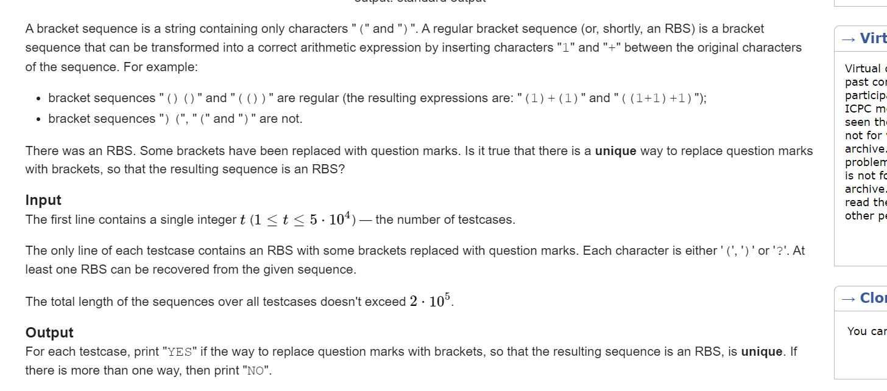

**C. Recover an RBS**
[Problem - 1709C - Codeforces](https://codeforces.com/problemset/problem/1709/C)



#### solve

序号模型：

1. 追求括号合法性：
   1. 能放（就方（ 。如果必然有合法解的话， 当我们无法构造合法化， 是因为）不足。应该尽量将）放在后面。
2. 判断合法性的方法：
   1. 将（抽象为1.
   2. 将 ）抽象为-1.
   3. 关注前缀和。合法要保证每一段前缀和都要大于等于0.

#### code

```cpp
#include<bits/stdc++.h>
using namespace std;

using ll = long long;
using i64 = long long;
using ull = unsigned long long;
using ld = long double;
using uint = unsigned int;
using pii = pair<int , int>;
using pli = pair<ll , int>;
using pll = pair<ll , ll>;


#define dbg(x) cerr << "[" << __LINE__ << "]" << ": " << x << "\n"

#define pb push_back
#define all(x) (x).begin(),(x).end()
#define fi first
#define se second
#define sz(x)  (int)(x).size()

const int inf = 1 << 29;
const ll INF = 1LL << 60;
const int N = 1E6 + 10;

int a[N];

void work(int testNo)
{
    string s;
    cin >> s;
    int n = sz(s);
    int l = 0 , r = 0;
    int low = -1 , high = inf;

    for (auto t : s) {
        if (t == ')')r++;
        else if (t == '(')l++;
    }
    // dbg(n);
    // dbg(l);
    for (int i = 0; i < n; i++) {
        if (s[i] == '(') {
            a[i] = 1;
        } else if (s[i] == ')') {
            a[i] = -1;
        } else if (s[i] == '?') {
            if (l < n / 2) {
                low = max(low , i);
                // dbg(low);
                l++;
                a[i] = 1;
            } else {
                high = min(i , high);
                r++;
                a[i] = -1;
            }
        }
    }
    // dbg(high);
    // dbg(low);
    // dbg(high);
    if (low == -1 || high == inf) {
        cout << "YES\n";
        return;
    }
    swap(a[low] , a[high]);
    int sum = 0;
    for (int i = 0; i < n; i++) {
        sum = sum + a[i];
        if (sum < 0) {
            cout << "YES\n";
            return;
        }
    }
    cout << "NO\n";
}
signed main()
{
    ios::sync_with_stdio(false);
    cin.tie(0);

    int t; cin >> t;
    for (int i = 1; i <= t; i++)work(i);
}

/* stuff you should look for
* int overflow, array bounds
* special cases (n=1?)
* do smth instead of nothing and stay organized
* WRITE STUFF DOWN
* DON'T GET STUCK ON ONE APPROACH
*/
```


