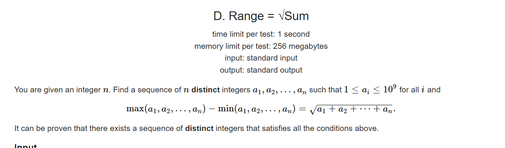
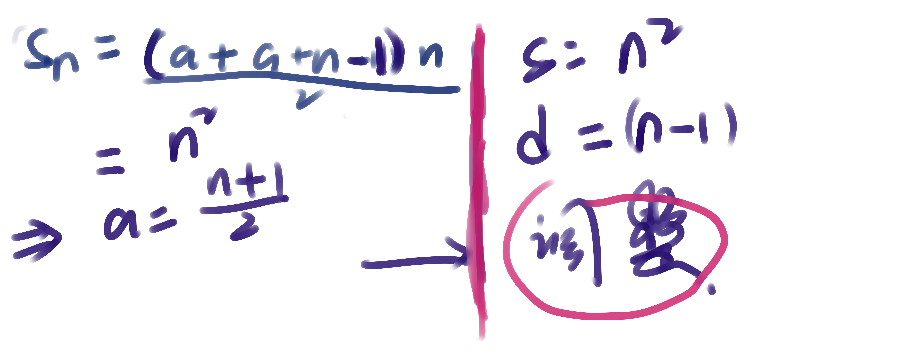

**D. Range = √Sum**
https://codeforces.com/contest/1758/problem/D

#### 题意



#### solve

追求特殊性 ， 使用等差数列的方案为每一个元素分配值。

尝试这样一种构造方式 ： 首项为a , 等差为1 。然后进行求和：摸一下a的范围为：
$$
a = (n + 1)/2;
$$


调整角度为 ： 

1. 所有元素加2：
   $$
   s = n^2 + 2*n\\
   d = n - 1;
   $$

2. 

2. 尾部元素尾部元素加1：
   $$
   S = n^2 + 2n + 1\\
   =(n +1)^2\\
   d = n
   $$

3. 

3. 首部减少1 , 倒数第二个元素增加1.
   $$
   S = (n + 1)^2\\
   d = n + 1
   $$

#### 偶数角度：


不要问 ， 问就是玄学：

#### code

```cpp
#include<bits/stdc++.h>
using namespace std;
typedef long long ll;

const int oo = 0x0fffffff;
const int N = 1E6 + 10;

int ans[N];

void work(int testNo)
{
	int n;
	cin >> n;
	if (n % 2) {
		for (int i = 1; i <= n; i++) {
			ans[i] = (n + 1) / 2 + i + 1;
		}
		ans[1]--;
		ans[n]++;
		ans[n - 1]++;
	} else {
		for (int i = 0; i < n / 2; i++) {
			ans[i + 1] = n / 2 + i;
		}
		for (int i = n / 2; i < n; i++) {
			ans[i + 1] = n + i - n / 2 + 1;
		}
	}
	for (int i = 1; i <= n; i++) {
		cout << ans[i] << " \n"[i == n];
	}
}


int main()
{
	ios::sync_with_stdio(false);
	cin.tie(0);

	int t; cin >> t;
	for (int i = 1; i <= t; i++)work(i);
}

/* stuff you should look for
* int overflow, array bounds
* special cases (n=1?)
* do smth instead of nothing and stay organized
* WRITE STUFF DOWN
* DON'T GET STUCK ON ONE APPROACH
*/
```

