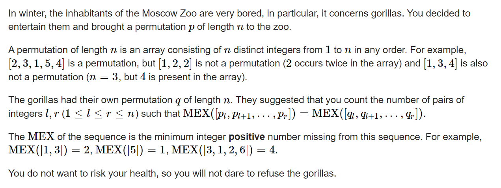
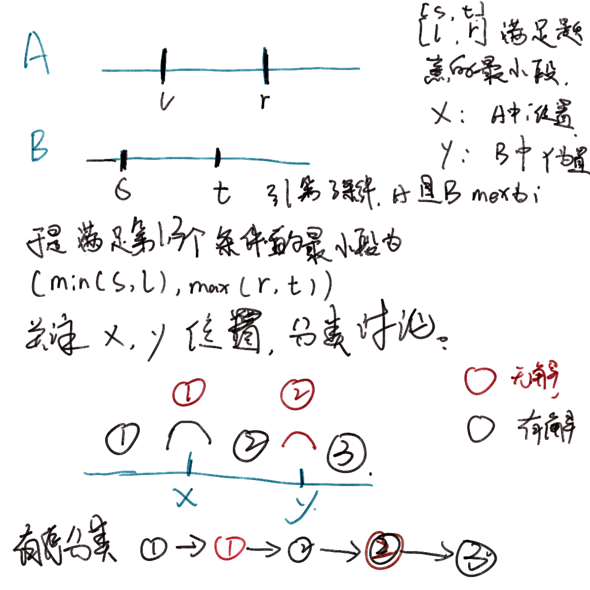

### **D. Moscow Gorillas**

 https://codeforces.com/contest/1793/problem/D



#### solve

对mex运算 ， 有一个常见的角度：
问题：使得mex值为i的子段有哪些特征？

1. 段包含所有小于 i 的数。
2. i - 1不在段中。

通过上述角度， 关注满足1条件的最小段 , i的位置，很容易就可以统计mex值为i的集合。

该问题中 ， 枚举mex ：2 .... n (特判n + 1 , 1) 关注几个值。然后枚举统计：：



#### code

```cpp
#include<bits/stdc++.h>
using namespace std;
using ll = long long;
const int N = 1E6 + 10;
int a[N], b[N];
ll pa[N], pb[N];
int n;
ll c(ll x, ll y) {
	if (x > y)return 0;
	ll l = y - x + 1;
	if (x <= 0 || y > n)return 0;
	return (l + 1) * l / 2;
}
ll f(ll x, ll y, ll l, ll r) {
	if (l > r) swap(l , r);
	if (x <= l) {
		if (y >= l) return 0;
		else return x * (l - y);
	}
	else if (x <= r) {
		if (y >= r) return 0;
		else return (x - l) * (r - y);
	}
	else {
		return (x - r) * (n - y + 1);
	}
}
int main()
{
	ios::sync_with_stdio(false);
	cin.tie(0);

	cin >> n;

	for (int i = 1; i <= n; i++) {
		cin >> a[i];
		pa[a[i]] = i;
	}
	for (int i = 1; i <= n; i++) {
		cin >> b[i];
		pb[b[i]] = i;
	}
	ll l, r, s, t;
	ll ans = 0;
	//枚举所有的mex值。
	//怎么快速找出第一个条件对应的区间范围？
	//利用前面的成果；
	//综合不了就特判；
	for (int i = 1; i <= n; i++) {
		//每一种情况的处理方法：
		//找到最小的覆盖所有的区间。
		//找到i的位置。
		//然后综合a ， b个数组对应的范围整理出解。
		if (i == 1) {
			ll x, y;
			x = l = r = pa[1];
			y = s = t = pb[1];
			if (x > y) swap(x, y);
			ans += c(1, x - 1);
			ans += c(x + 1, y - 1);
			ans += c(y + 1, n);
		}
		else {
			ll x, y;
			l = min(l, pa[i - 1]);
			r = max(r, pa[i - 1]);
			s = min(s, pb[i - 1]);
			t = max(t, pb[i - 1]);
			//各种情况分类讨论。
			x = pa[i]; y = pb[i];
			ll mi = min(l, s);
			ll my = max(r, t);
			ans += f(mi, my, x, y);
		}
	}
	cout << ans + 1 << '\n';
}
```


