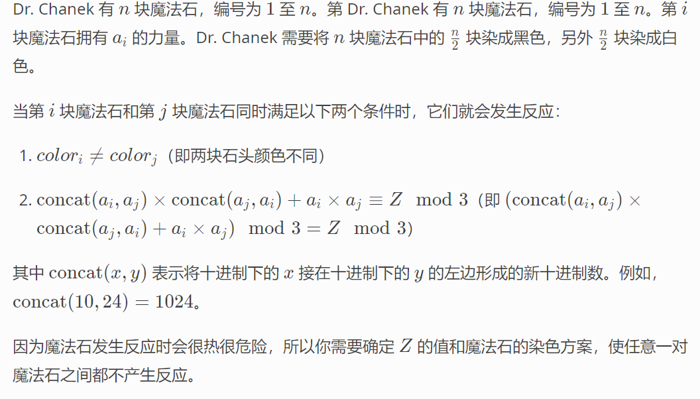

**H. Hot Black Hot White**
https://codeforces.com/problemset/problem/1725/H



#### solve

1. 对于该运算中， 关注其中一个值， 在其中做出的贡献： 

关注： 

1. 10000 % 3 = 1； 。 无论有多少个0.
2. 上述运算式子左值化简为：

$$
(a_i ^2 + a_j^2 + 3a_ia_j)\equiv Z( mod\quad3) \\
a_i^2 + a_j^2 \equiv Z (mod\quad 3)\\
$$

3. 一个数的平方 ， mod 3 等于2 或者等于0；

于是这样就转变成了一个分类讨论构造问题：
记录cunt0 , cunt1 分别表示 $a_i ^2$为 0 或1的个数。

1.  cunt0 > cunt1 ： 取Z等于2；
1.  cunt0 < cunt1 ： 取Z等于 0；

#### code

```cpp
#include<bits/stdc++.h>
using namespace std;

using ll = long long;
using i64 = long long;
using ull = unsigned long long;
using ld = long double;
using uint = unsigned int;
using pii = pair<int , int>;
using pli = pair<ll , int>;
using pll = pair<ll , ll>;


#define dbg(x) cerr << "[" << __LINE__ << "]" << ": " << x << "\n"

#define all(x) (x).begin(),(x).end()
#define sz(x) (int)(x).size()
#define pb push_back
#define fi first
#define se second

const int inf = 1 << 29;
const ll INF = 1LL << 60;
const int N = 1E6 + 10;

int a[N];

signed main()
{
	ios::sync_with_stdio(false);
	cin.tie(0);
	int n = 10;
	cin >> n;
	vector<int> rec[2];
	for (int i = 0; i < n; i++) {
		ll x; cin >> x;
		rec[x * x % 3].push_back(i);
	}
	if (sz(rec[0]) < sz(rec[1])) {
		cout << 0 << "\n";
		swap(rec[0] , rec[1]);
	} else cout << 2 << "\n";
	string ans(n , '0');
	for (int i = 0; i < n / 2; i++) {
		ans[rec[0][i]] = '1';
	}
	cout << ans << "\n";
}

/* stuff you should look for
* int overflow, array bounds
* special cases (n=1?)
* do smth instead of nothing and stay organized
* WRITE STUFF DOWN
* DON'T GET STUCK ON ONE APPROACH
*/
```


