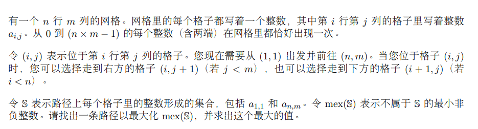

# D. Bookshelves

[Problem - D - Codeforces](https://codeforces.com/contest/981/problem/D)

Mr Keks is a typical white-collar in Byteland.

He has a bookshelf in his office with some books on it, each book has an integer positive price.

Mr Keks defines the value of a shelf as the sum of books prices on it.

Miraculously, Mr Keks was promoted and now he is moving into a new office.

He learned that in the new office he will have not a single bookshelf, but exactly $k$ bookshelves. He decided that the beauty of the $k$ shelves is the [bitwise AND](https://en.wikipedia.org/wiki/Bitwise_operation#AND) of the values of all the shelves.

He also decided that he won't spend time on reordering the books, so he will place several first books on the first shelf, several next books on the next shelf and so on. Of course, he will place at least one book on each shelf. This way he will put all his books on $k$ shelves in such a way that the beauty of the shelves is as large as possible. Compute this maximum possible beauty.

Keks 先生是典型的拜特兰白领。
他的办公室里有一个书架，上面摆放着一些书，每本书的价格都是整数正数。
Keks 先生将书架的价值定义为书架上书籍价格的总和。
神奇的是，Keks 先生升职了，现在他正在搬进新办公室。
他了解到，在新办公室里，他将拥有的不是一个书架，而是整整 $k$个书架。他决定，$k$个书架的妙处在于将所有书架的值进行【位和】(https://en.wikipedia.org/wiki/Bitwise_operation#AND)。
他还决定不把时间花在重新排序上，所以他会在第一个书架上放几本第一本书，在下一个书架上放几本第二本书，以此类推。当然，他至少会在每个书架上放一本书。这样，他就会把所有的书放在 $k$个书架上，使书架的美观度尽可能大。计算这个最大可能的美观度。

### solve

类比2023广东省省赛

1. 省赛

和二分倍增差不多。通过对解空间地把握 ， 快速地域地规模：在当前问题下：
通过从从高到低，贪心的考虑每一个数位的情况：
首先检查最高数位30 是否为1。如果可行解中包括了1， 那么最终的解，在该位置上必须为1.因为更低位无论怎么填都无法大于当前的位权：
由于数据范围比较小。因此检查是否可行可以用一个dp直接做：

**状态设计：**
$f_{i , k}$ 表示将 1...i个元素划分成k组。每一组和之间的与和是否可以为x；
**状态转移方程**
简单的线性转移：计算$f_{i ,k}$，考虑尾段拼接到j因此可以直接从$f_{j  - 1, k - 1}$中转移。 

### 生长思考：

校赛预案：
求一个矩阵的最大与和。
同上，递进的枚举数位： 求出最大与和。

### code

```cpp
#include<bits/stdc++.h>
using namespace std;
using ll = long long;
#define all(x) (x).begin(),(x).end()
#define sz(x) (int)(x).size()
const int inf = 1E9 + 7;
const ll INF = 1E18 + 7;
const int N = 51;
const int M = 57;
ll a[N] , sum[N];
int n , k;
bool f[N][N];
bool check(ll x) {
	memset(f , false , sizeof f);
	f[0][0] = true;
	// 边界：
	for (int i = 1; i <= n; i++) {
		for (int j = 0; j < i; j++) {
			for (int K = k; K >= 1; K--) {
				f[i][K] |= (((sum[i] - sum[j]) & x) == x) && f[j][K - 1];
			}
		}
	}
	return f[n][k];
}
signed main()
{
	ios::sync_with_stdio(false);
	cin.tie(0);
	cin >> n >> k;
	for (int i = 1; i <= n; i++) {
		cin >> a[i];
		sum[i] = sum[i - 1] + a[i];
	}
	ll ans = 0;
	for (int i = M; i >= 0; i--) {
		if (check(ans | 1LL << i)) ans |= 1LL << i;
	}
	cout << ans << '\n';
}
```
