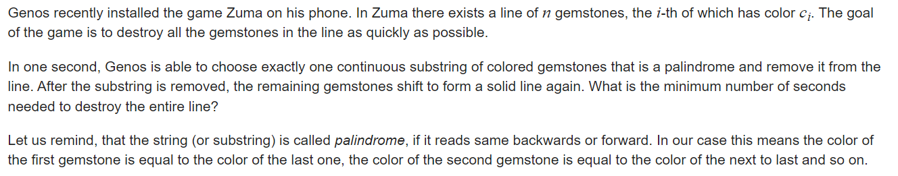

**B. Zuma**
https://codeforces.com/contest/607/problem/B



#### solve

考察操作一个区间内的解：发现总共有几种操作空间：

1. 一整个消除：（区间本身就是回文串：）
2. 分开消除：
   1. 首尾不同 ， 所有有效的解必然都是看作分成两个区间进行操作。每次操作看作一些连续的块： 最后一步的区间的边界为界限：
      1. 可以看出两部分的块是独立的： 
      2. 由于首尾不同 ， 不能够整只区间移除
   2. 首尾相同： 
      1. 相比于普通区间的操作方向更多：
         1. 普通变成两个区间的处理 ；如上2.1：
         2. 在  $dp_{l + 1 , r- 1}$的最优方案下 ， 溢出最后一个区间时， 顺便打包首尾。

**状态定义：**

$f_{low , high}$ 表示 ， 移除区间 [low , high]的回文串的最小操作次数。

**状态转移：**

1. $s_{low} \ne s_{high}$  : $f_{low , high} = MIN_{mid = low}^{high - 1}(f_{low , mid} + f_{mid+ 1 , high})$
2. $s_{low} = s_{high} : $ 
   1. $f_{low , high} = MIN_{mid = low} ^{high - 1}(f_{low , mid} + f_{mid + 1 , high})$
   2. $f_{low , high} = MIN(f_{low , high} , f_{low + 1 , high - 1})$

**初始化：**

1. $f_{low , low} = 1 $
2. $if(s_{low} \ne s_{low+ 1})f_{low , low + 1} = 1$

#### code

```cpp
const int inf = 1 << 29;
const ll INF = 1LL << 60;
const int N = 1010;
int f[N][N];
int a[N];

signed main()
{
	ios::sync_with_stdio(false);
	cin.tie(0);
	int n; cin >> n;
	for (int i = 1; i <= n; i++) {
		cin >> a[i];
	}
	memset(f , 0x3f , sizeof f);
	for (int len = 1; len <= n; len++)
		for (int l = 1; l + len - 1 <= n; l++) {
			int r = l + len - 1;
			if (len == 1) {f[l][r] = 1; continue;}
			if (len == 2) {f[l][r] = 1 + (a[l] != a[r]); continue;}
			if (a[l] == a[r]) {f[l][r] = f[l + 1][r - 1];}
			for (int mid = l; mid < r; mid++)
				f[l][r] = min(f[l][r] , f[l][mid] + f[mid + 1][r]);
		}
	cout << f[1][n] << "\n";
}
```
