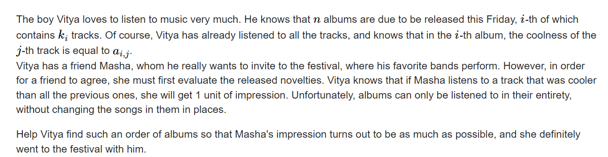

**E. Music Festival**
https://codeforces.com/contest/1802/problem/E



将若干个数列拼接， 找出作为前缀严格最大值的元素个数；

参考题解：

#### solve

1. 最暴力的做法：

   1. 即使考虑第i位元素， 枚举新的元素时 ， 也要考虑前缀的具体情况。

2. 观察出一些现象：
   
   1. 考虑一个数组序列的贡献情形。
   
      1. 发现产生贡献的是升序序列的子序列：如下：
   
      ```txt
      1 4 3 5 6 7 3
      - >  1 4 5 6 7
      ```
   
   2. 将上述的所有可能贡献序列整理成一个集合， 并且对其进行一个依据$r_i$的大小进行排序；
   
      1. 对于任意的组合 ， 我们拼接在一些方案上 ： 关注两个属性：
         1. 新拼接上的数组贡献了多少。
         2. 确定上述1贡献的具体大小之后 ， 其贡献如何？

**状态定义：**

$f_i:$ 表示以i为结尾的序列中的最大贡献;

**状态转移：**

1. 枚举前缀贡献。 确定其关注序列结尾的取值范围；求一个前缀最大值。
2. 上述要求我们子问题已经求出。因此，需要对r做一个排序。其更小的back。 的子问题已经求出。

**实现**

1. 树状数组维护即可。
2. 由于值域比较大。采取面向元素的初始化方式。

#### code

```cpp
#include<bits/stdc++.h>
using namespace std;

using ll = long long;
using i64 = long long;
using ull = unsigned long long;
using ld = long double;
using uint = unsigned int;
using pii = pair<int , int>;
using pli = pair<ll , int>;
using pll = pair<ll , ll>;


#define dbg(x) cerr << "[" << __LINE__ << "]" << ": " << x << "\n"

#define all(x) (x).begin(),(x).end()
#define sz(x) (int)(x).size()
#define pb push_back
#define fi first
#define se second

const int inf = 1 << 29;
const ll INF = 1LL << 60;
const int N = 2E5 + 10;

int c[N];
int n;
void modify(int x , int d) {
	for (; x < N; x += x & -x)
		c[x] = max(c[x] , d);
}

int query(int x) {
	int res = 0;
	for (; x; x -= x & -x)
		res = max(res , c[x]);
	return res;
}
void clear(int x) {
	for (; x < N; x += x & -x)
		c[x] = 0;
}
// 其作用是记录以某个值为结尾最小值的个数。
// 当其作为最小值之后，其余后边的贡献都将是0.

void work(int testNo)
{
	int n;
	cin >> n;
	vector<vector<int>> rec(n);
	for (int i = 0; i < n; i++) {
		int  m;
		cin >> m;
		int mx = 0;
		for (int j = 0; j < m; j++) {
			int x; cin >> x;
			if (x > mx) {
				mx = x;
				rec[i].push_back(mx);
			}
		}
	}
	sort(rec.begin() , rec.end() , [&](vector<int>& a , vector<int> & b) {
		return a.back() < b.back();
	});
	int ans = 0;
	for (int i = 0; i < n; i ++) {
		int mx = 0;
		for (int j = 0; j < (int)rec[i].size(); j++) {
			// 当前枚举项为贡献多少项。
			mx = max(mx , query(rec[i][j] - 1) + (int)rec[i].size() - j);
			ans = max(ans , mx);
		}
		modify(rec[i].back() , mx);
	}
	for (int i = 0; i < n; i++) {
		clear(rec[i].back());
	}
	cout << ans << "\n";
}
signed main()
{
	ios::sync_with_stdio(false);
	cin.tie(0);

	int t; cin >> t;
	for (int i = 1; i <= t; i++)work(i);
}
/* stuff you should look for
* int overflow, array bounds
* special cases (n=1?)
* do smth instead of nothing and stay organized
* WRITE STUFF DOWN
* DON'T GET STUCK ON ONE APPROACH
*/
```

