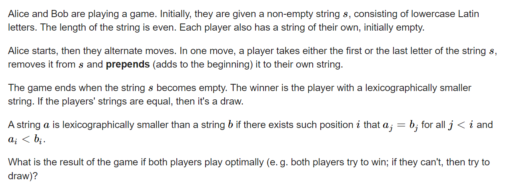

**D. Letter Picking**
https://codeforces.com/contest/1728/problem/D



#### solve
一般而言， 当博弈的资源规模较小时 ， 可以使用dp转移记录。上述就是例子：
**状态定义**

$f_{i , j}$表示当前选到i , j区间时候， 先手的情况。 为了方便转移， 保证j - i + 1为偶数长度。从而保证了当前的先手为alice。

其中其解有三种 0 ， 1 ， 2.分别表示 先手输 ， 平 ， 胜

**转移方程**
基于一个状态 ， 枚举可能发生的情况：两个人分别取

1. low , low + 1
2. low , high
3. high , low
4. high , high - 1

**初始化**

在这个例中 ， 与其想办法为， 最小状态转移得到的，不能存在的状态分配一个合理值。不如直接初始化zui'xiao

#### code

```cpp
#include<bits/stdc++.h>
using namespace std;
typedef long long ll;
const int oo = 0x0fffffff;
const int N = 2E3 + 10;
int f[N][N];
void work(int testNo){
	string s;
	cin >> s;
	const int n = s.size();
	//0表示更小， 1 , 表示更多。
	for (int i = 1; i < n; i++) {
		if (s[i] == s[i - 1])f[i - 1][i] = 1;
		//表示更小。
		//表示更大。
		else f[i - 1][i] = 2;
	}
	for (int len = 4; len <= n; len += 2)
		for (int low = 0 , high = len - 1; high < n; low++ , high++) {
			//一共有四种选择情况。
			//low low + 1
			int t = f[low + 2][high];
			int a = 0;
			if (s[low] == s[low + 1]) {
				a = t;
			} else if (s[low] < s[low + 1]) {
				if (t == 1 || t == 2) a = 2;
				else a = 0;
			} else {
				if (t == 2) {
					a = 2;
				} else if (t == 1)a = 1;
				else a = 0;
			}
			t = f[low + 1][high - 1];
			int b = 0;
			if (s[low] == s[high]) {
				b = t;
			} else if (s[low] < s[high]) {
				if (t == 2 || t == 1) b = 2;
				else b = 0;
			} else {
				if (t == 2) {
					b = 2;
				} else b = 0;
			}
			//第二大类。
			t = f[low][high - 2];
			int c = 0;
			if (s[high] == s[high - 1]) {
				c = t;
			} else if (s[high] < s[high - 1]) {
				if (t == 2 || t == 1) c = 2;
				else c = 0;
			} else {
				if (t == 2) {
					c = 2;
				} else c = 0;
			}
			t = f[low + 1][high - 1];
			int d = 0;
			if (s[high] == s[low]) {
				d = t;
			} else if (s[high] < s[low]) {
				if (t == 2 || t == 1) d = 2;
				else d = 0;
			} else {
				if (t == 2) {
					d = 2;
				} else d = 0;
			}
			f[low][high] = max(min(a , b) , min(c , d));
		}
	if (f[0][n - 1] == 1) {
		cout << "Draw\n";
	} else cout << "Alice\n";
}
int main(){
	ios::sync_with_stdio(false);
	cin.tie(0);
	int t; cin >> t;
	for (int i = 1; i <= t; i++)work(i);
}
/* stuff you should look for
* int overflow, array bounds
* special cases (n=1?)
* do smth instead of nothing and stay organized
* WRITE STUFF DOWN
* DON'T GET STUCK ON ONE APPROACH
*/
```


