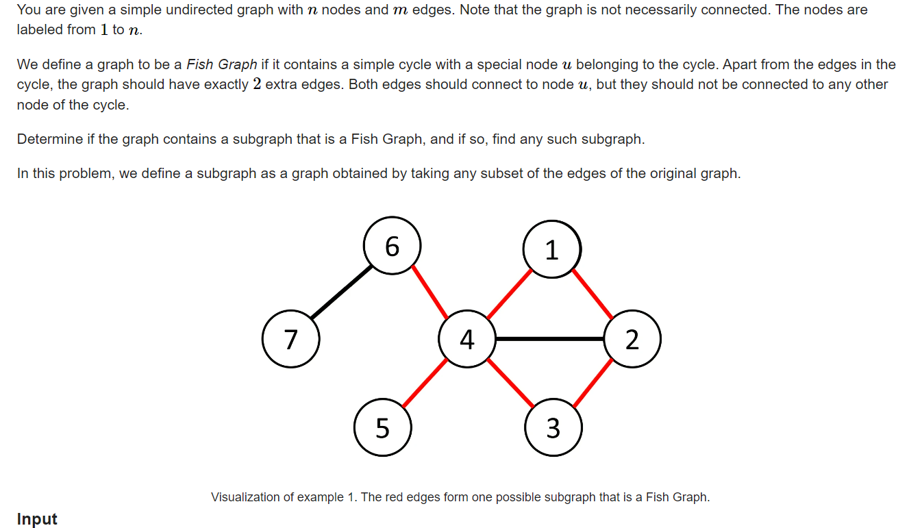

**D. Fish Graph**
https://codeforces.com/contest/1818/problem/D

#### 简介：



找一个环， 其中一个点挂着其它两个点： 尝试找出这个环：

#### solve

1. **怎么找一个环？**
2. **在拥有环信息处理能力的基础上， 怎么判断题目中要求的环？**
3. **怎么具体找出图上的环？**

---

##### 关于问题1的解决：

1. bellman ford。
   1.  [Currency Exchange.md](Currency Exchange.md) （判断正数环的存在性。）
   2.  [Extended Traffic.md](..\..\..\..\题单\kuangbing\最短路练习\Extended Traffic.md) （找出负环， 并且将负环可达的点标记。）
2.  [环问题集录.md](..\..\..\..\..\Logrithm\图论\基础图论\环\环问题集录.md) （全部放在这里：）

找一个环 ， 就bfs ， dfs搜索发现自己就可以找出一个环了。

##### 关于问题2的解决：

容易发现一个结论： 只要环上有一个点是度数为4就可以找到一个节点。

题解中的有一句话很深刻：Try to prove this, and see if your proof can be turned into an algorithm.

##### 关于问题3的解决：

关注最短环： （因为特殊的 ， 度数为4的点连起来的点也在自己所处的一个环中， 但是只要找出最小的环，另外两条边必然在环外。）

基于一边找最小环的办

1. 删边再bfs：
   1. 复杂度分析 ： bfs的话， 每个点只会经历一遍。否则在之前出现解了。
   2. 怎么维护 ， 
      1. 打标记： 和起点节点第二次相遇。
      2. 终点转换为起点的相邻点即可（下面tourist）的代码 ， 就是这个bfs的角度。

#### 生长：

1. 对于其中任何一条边 ， 找到最小环都有解： 不要求找到所有环集合中的最小环。
   1. 反证法 ： 如果不是对一条边最小环，其中不可能包含多个与其起点相连的边  ， 否则就会矛盾，该环可以更小。
2. A_G的做法中 ， 道理也是相同的。dfs做法：
   1. 递归的临界：如果遇到起点的相邻点。就说明找到了一个较小的环： 
      1. 感受： 路径上只有两个相邻点。

前辈代码：

----------

自己的代码是照着tourist写的。所以也没放下来的必要。

#### code jly

```cpp
#include <bits/stdc++.h>

using i64 = long long;

void solve() {
    int n, m;
    std::cin >> n >> m;
    
    std::vector<std::vector<int>> adj(n);
    for (int i = 0; i < m; i++) {
        int u, v;
        std::cin >> u >> v;
        u--, v--;
        adj[u].push_back(v);
        adj[v].push_back(u);
    }
    
    for (int u = 0; u < n; u++) {
        if (adj[u].size() >= 4) {
            std::queue<std::pair<int, int>> q;
            std::vector<std::array<int, 2>> s(n, {-1, -1});
            std::vector<std::array<std::pair<int, int>, 2>> pre(n);
            for (auto v : adj[u]) {
                s[v][0] = v;
                pre[v][0] = {u, 0};
                q.emplace(v, 0);
            }
            while (!q.empty()) {
                auto [x, t] = q.front();
                q.pop();
                
                for (auto y : adj[x]) {
                    if (y != u) {
                        if (s[y][0] == -1) {
                            s[y][0] = s[x][t];
                            pre[y][0] = {x, t};
                            q.emplace(y, 0);
                        } else if (s[y][1] == -1 && s[y][0] != s[x][t]) {
                            s[y][1] = s[x][t];
                            pre[y][1] = {x, t};
                            q.emplace(y, 1);
                        }
                    } else if (t == 1) {
                        std::cout << "YES\n";
                        std::vector<bool> vis(n);
                        std::vector<std::pair<int, int>> ans;
                        ans.emplace_back(u + 1, x + 1);
                        while (x != u) {
                            vis[x] = true;
                            auto [y, q] = pre[x][t];
                            ans.emplace_back(x + 1, y + 1);
                            std::tie(x, t) = std::pair(y, q);
                        }
                        
                        int k = 0;
                        for (auto v : adj[u]) {
                            if (!vis[v] && k < 2) {
                                ans.emplace_back(u + 1, v + 1);
                                k++;
                            }
                        }
                        
                        std::cout << ans.size() << "\n";
                        for (auto [x, y] : ans) {
                            std::cout << x << " " << y << "\n";
                        }
                        
                        return;
                    }
                }
            }
        }
    }
    std::cout << "NO\n";
}

int main() {
    std::ios::sync_with_stdio(false);
    std::cin.tie(nullptr);
    
    int t;
    std::cin >> t;
    
    while (t--) {
        solve();
    }
    
    return 0;
}
```


#### tourist

```cpp
/**
 *    author:  tourist
 *    created: 29.04.2023 10:37:43       
**/
#include <bits/stdc++.h>

using namespace std;

#ifdef LOCAL
#include "algo/debug.h"
#else
#define debug(...) 42
#endif

int main() {
  ios::sync_with_stdio(false);
  cin.tie(0);
  int tt;
  cin >> tt;
  while (tt--) {
    int n, m;
    cin >> n >> m;
    vector<vector<int>> g(n);
    for (int i = 0; i < m; i++) {
      int x, y;
      cin >> x >> y;
      --x; --y;
      g[x].push_back(y);
      g[y].push_back(x);
    }
    vector<pair<int, int>> edges;
    for (int i = 0; i < n; i++) {
      if (g[i].size() >= 4) {
        vector<bool> nei(n, false);
        for (int j : g[i]) {
          nei[j] = true;
        }
        vector<int> pv(n, -1);
        pv[i] = -2;
        int win = -1;
        for (int j : g[i]) {
          if (pv[j] == -1) {
            vector<int> que(1, j);
            pv[j] = i;
            for (int b = 0; b < (int) que.size(); b++) {
              for (int to : g[que[b]]) {
                if (pv[to] == -1) {
                  que.push_back(to);
                  pv[to] = que[b];
                  if (win == -1 && nei[to]) {
                    win = to;
                  }
                }
              }
            }
          }
        }
        if (win != -1) {
          edges.emplace_back(i, win);
          int x = win;
          while (x != i) {
            edges.emplace_back(x, pv[x]);
            x = pv[x];
          }
          vector<bool> used(n, false);
          for (auto& e : edges) {
            used[e.first] = true;
            used[e.second] = true;
          }
          vector<int> rest;
          for (int y : g[i]) {
            if (!used[y]) {
              rest.push_back(y);
            }
          }
          assert(rest.size() >= 2);
          edges.emplace_back(i, rest[0]);
          edges.emplace_back(i, rest[1]);
          break;
        }
      }
    }
    if (edges.empty()) {
      cout << "NO" << '\n';
    } else {
      cout << "YES" << '\n';
      cout << edges.size() << '\n';
      for (auto& e : edges) {
        cout << e.first + 1 << " " << e.second + 1 << '\n';
      }
    }
  }
  return 0;
}

```

#### A_G

```cpp
#include <bits/stdc++.h>
using namespace std;

const int N = 2005;
vector<int> G[N];

int fa[N], vis[N];
int n, m;
bool is_nbr[N], used[N];

int root = 0;
int z = -1;

bool dfs(int v, int p) {
  vis[v] = 1;
  fa[v] = p;
  if (is_nbr[v] && p != root) {
    z = v;
    return 1;
  }
  for (int u: G[v]) {
    if (!vis[u]) {
      if (dfs(u, v)) return 1;
    }
  }
  return 0;
}

void solve() {
  cin >> n >> m;
  for (int i = 0; i < m; i++) {
    int u, v;
    cin >> u >> v;
    G[u].push_back(v);
    G[v].push_back(u);
  }

  for (int v = 1; v <= n; v++) {
    if ((int)G[v].size() < 4) continue;
    fill(vis+1, vis+n+1, 0);
    fill(is_nbr+1, is_nbr+n+1, 0);
    fill(used+1, used+n+1, 0);
    z = -1;
    root = v;
    for (int u: G[v]) is_nbr[u] = 1;
    if (dfs(v, v)) {
      cout << "YES\n";
      vector<pair<int, int>> edges;
      edges.emplace_back(z, v);
      used[z] = 1;
      int t = z;
      for (t = z; t != v; t = fa[t]) {
        edges.emplace_back(t, fa[t]);
        used[t] = 1;
        if (fa[t] == v) break;
      }
      int cnt = 0;
      for (int c: G[v]) {
        if (used[c]) continue;
        edges.emplace_back(c, v);
        cnt++;
        if (cnt == 2) break;
      }
      cout << edges.size() << '\n';
      for (auto& [x, y]: edges) cout << x << ' ' << y << '\n';
      return;
    }
  }
  cout << "NO\n";
}

int main () {
  ios_base::sync_with_stdio(0); cin.tie(0);
  int T;
  cin >> T;
  while (T--) {
    solve();
    for (int i = 1; i <= n; i++) G[i].clear();
  }
}
```

