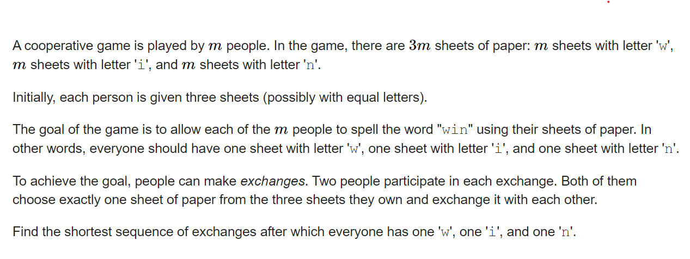

**B. Letter Exchange**
https://codeforces.com/contest/1785/problem/B

t宝的题！！！



#### solve

容易将人的持牌情况分类：

**策略如下：** 关注一个人缺什么牌， 多了什么牌。

1. 建立一个图描述其中的关系：
   1. 如果i 缺y 多x 建立一条边 , x -》 y . 并且将这条边标记为i。
2. 基于上图的一个结论：
   1. 如果同时存在 x  - > y , y - > x。交换两个人的x , y 牌。
   2. 上述1不断执行完之后 ， 剩下了若干个三元环 。通过两次交换即可。

这个结论怎么这么熟悉跌？ 得证证啦！

-------------


-------

#### code

```cpp
#include<bits/stdc++.h>
using namespace std;
using ll = long long;
const int N = 1E6 + 10;
map<char, int> mp;
map<int, char> restore;
vector<int> g[3][3];
int ans[N][4], tot;
void add(int a, int b, int c, int d) {
	++tot;
	ans[tot][0] = a;
	ans[tot][1] = b;
	ans[tot][2] = c;
	ans[tot][3] = d;
}
void solve() {
	tot = 0;
	int n; cin >> n;
	for (int i = 0; i < 3; i++) {
		for (int j = 0; j < 3; j++) {
			g[i][j].clear();
		}
	}
	for (int i = 1; i <= n; i++) {
		int c[3] {};
		string s;
		cin >> s;
		for (int j = 0; j < 3; j++) {
			c[mp[s[j]]]++;
		}
		//建图。
		for (int j = 0; j < 3; j++)
			for (int k = 0; k < 3; k++) {
				if (c[j] > 1 && c[k] < 1)g[j][k].push_back(i);
			}
	}
	//建图完成。
	//然后先处理
	for (int i = 0; i < 3; i++)
		for (int j = 0; j < 3; j++) {
			while (g[i][j].size() && g[j][i].size()) {
				add(g[i][j].back(), i, g[j][i].back(), j);
				g[i][j].pop_back();
				g[j][i].pop_back();
			}
		}
	//接着处理答辩
	int u = 0, v = 1, w = 2;
	if (g[v][u].size()) {
		swap(u, v);
	};
	for (int i = 0; i < (int)g[u][v].size(); i++) {
		int a = g[u][v][i];
		int b = g[v][w][i];
		int c = g[w][u][i];
		add(a, u, b, v);
		add(b, u, c, w);
	}
	cout << tot << "\n";
	for (int i = 1; i <= tot; i++) {
		// cout << ans[i][0] << " " << ans[i][1] << " " << ans[i][2] << " " << ans[i][3] << "\n";
		cout << ans[i][0] << " " << restore[ans[i][1]] << " " << ans[i][2] << " " << restore[ans[i][3]] << "\n";
	}
}
int main()
{
	ios::sync_with_stdio(false);
	cin.tie(0);
	mp['w'] = 0;
	restore[0] = 'w';
	mp['i'] = 1;
	restore[1] = 'i';
	mp['n'] = 2;
	restore[2] = 'n';
	int t; cin >> t;
	for (int i = 1; i <= t; i++)solve();
}
```

#### 生长思考：

1. 

