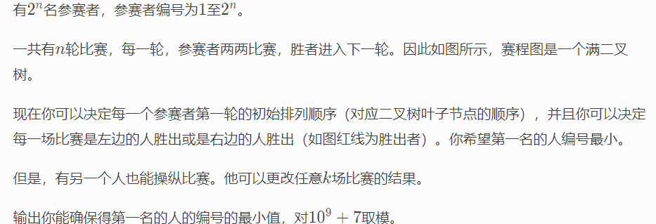

**D. Madoka and The Corruption Scheme**
https://codeforces.com/contest/1717/problem/D



#### solve

假定一个模拟锦标赛竞争的二叉树：

1. 处理等效 ： 不妨调整这棵树， 使得每次胜者都是左边的选手。因此操纵者在上面的操作 ， 相当于从根节点往下走， 默认情况下往左走。操纵者不断地改变移动方向， 问操纵者可以到达哪几种终点：

2. 这个可以由组合计算得出：

   1. 如果当前可选择次数大于层数。那么结果为$2^n$

   2. 否额， 一种选择对应一个人， 总共是
      $$
      \sum _{j=0}^{k}C_{n}^{j}
      $$

3. 

#### code

```cpp
int fac[N_c] , infac[N_c];
ll quickly_pow(ll x, ll n, ll p)
{
	ll res = 1;
	while (n > 0)
	{
		if (n & 1)res = res * x % p;
		x = x * x % p;
		n >>= 1;
	}
	return res;
}
void init() {
	fac[0] = infac[0] = 1;
	for (int i = 1; i < N_c; i++)
	{
		fac[i] = 1LL * fac[i - 1] * i % mod;
		infac[i] = 1LL * infac[i - 1] * quickly_pow(i, mod - 2, mod) % mod;
	}
}
int c(int a , int b) {
	return 1LL * fac[a] * infac[b] % mod * infac[a - b] % mod;
}
signed main()
{
	ios::sync_with_stdio(false);
	cin.tie(0);
	init();
	int n , k;
	cin >> n >> k;
	if (k >= n) {cout << quickly_pow(2 , n , mod); return 0;}
	ll ans = 0;
	for (int i = 0; i <= k; i++) {
		ans = (ans + c(n , i)) % mod;
	}
	cout << ans << "\n" << "\n";
}
```

