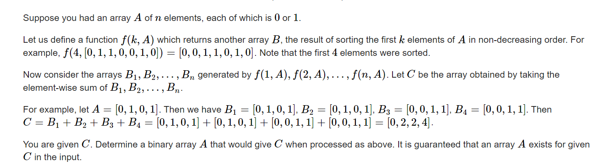

**D. Reverse Sort Sum**
https://codeforces.com/contest/1659/problem/D



#### sove

非常精彩的思维过程：
开启思路的关键是问这几个问题：用问题来指导推理，挖掘现象，进而整理出可行算法：

1. 构造的顺序是什么？（正向 ，逆向）
2. 下面考虑逆向推导：
   1. 关注问题中的什么属性？精力集中点在于挖掘这些属性之间的关系。
   2. $a_n$的值怎么确定？ 
   3. 怎么将确定$a_n$的算法推广到 $a_i$

---------

1.1 逆向或者正向。综合题解， 逆向更容易理解：

2.1 方向比较多， 但还是尝试问一问自己。在这个问题中：

 	1. $a_i$
 	2. $c_i$
 	3. 前缀中1的个数。


2.2 

1. 关注$c_i$上的贡献情况。一类是在对应的数组中未经过排序的1贡献。 二类在对应数组中排序部分的贡献。
2. 对于最后一位
   1. $a_n = 1$ ： 1类（未经排序）贡献为n - 1 。 二类贡献为1. 总体上贡献为n
   2. $a_n = 0:$     2类 (未经排序）贡献 为0 。二类贡献为0或者1（取决于1的个数）     

2.3 

1. 据此相似地， 详细研究$c_i$的贡献。
2. 通过未排序地贡献就可以推导出$a_i$

**实现细节：**

1. 处理排序后贡献中： 涉及到了区间减的操作：
   1. 数据结构维护。
   2. 差分维护。

#### code

```cpp
int c[N] , a[N] , d[N];
void work(int testNo)
{
	int n;
	cin >> n;
	ll sum = 0;
	fill(c , c + n + 1 , 0);
	fill(d , d + n + 1 , 0);
	fill(a , a + n + 1 , 0);
	for (int i = 1; i <= n; i++) {
		cin >> c[i];
		sum += c[i];
	}
	int cunt = sum / n;
	int t = 0;
	for (int i = n; i >= 1 && cunt; i--) {
		t += d[i];
		d[i - 1]--;
		d[i - cunt]++;
		if (c[i] + t == i) {
			a[i] = 1;
			cunt--;

		}
	}
	for (int i = 1; i <= n; i++)
		cout << a[i] << " \n"[i == n];
}


signed main()
{
	ios::sync_with_stdio(false);
	cin.tie(0);

	int t; cin >> t;
	for (int i = 1; i <= t; i++)work(i);
}

/* stuff you should look for
* int overflow, array bounds
* special cases (n=1?)
* do smth instead of nothing and stay organized
* WRITE STUFF DOWN
* DON'T GET STUCK ON ONE APPROACH
*/
```

