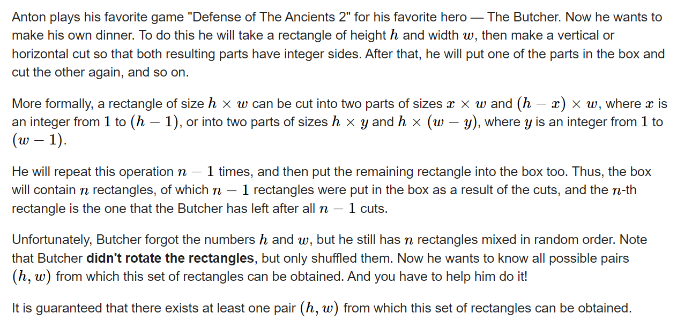

**D. The Butcher**
https://codeforces.com/contest/1820/problem/D



#### solve

几个关键：

1. 该矩形的面积是确定的。
2. 特殊的裁剪方式， 并且丢弃其中一部分。

考虑第一步： 

1. 最终有两种可能， 沿着高裁剪，沿着宽裁剪：
   1. 两种裁剪方式下， 导致了一些结果： 最大高， 或者最大宽。
2. 然后根据上述的结论， 可以明确：
   1. 枚举两种可能， 最大高  最大宽之后 ， 由于面积确定。宽与高就确定了。
   2. 所以一共只有两种可能结果， 最后就是check这两种结果的可行性即可。
3. check设计：(从几个角度入手：)
   1. 


#### code

```cpp
#include<bits/stdc++.h>
using namespace std;
typedef long long ll;
typedef pair<ll , ll>pll;
#define fi first
#define se second
const int oo = 0x0fffffff;
const int N = 1E6 + 10;
int n;

bool check(ll H , ll W , multiset<pll , greater<pll> > h , multiset<pll , greater<pll> > w) {
	//维护当前的两种情形。
	//交替变换处理怎么实现？
	// cout << "\n\n\n";
	for (int i = 0 ; i < n; i++) {
		pll a = *h.begin();
		pll b = *w.begin();
		// cout << H << " " << W << "\n";
		if (H == a.fi) {
			W -= a.se;
			h.erase(h.begin());
			w.erase(w.lower_bound({a.se , a.fi}));
		} else if (W == b.fi) {
			H -= b.se;
			w.erase(w.begin());
			h.erase(h.lower_bound({b.se , b.fi}));
		} else return false;
	}
	return true;
}

void work(int testNo)
{
	cin >> n;
	multiset<pll , greater<pll> >h1 , w1;
	ll s = 0;
	for (int i = 0; i < n; i++) {
		ll h , w;
		cin >> h >> w;
		s += h * w;
		h1.insert({h , w});
		w1.insert({w , h});
	}
	ll mxh = h1.begin()->fi;
	ll mxw = w1.begin()->fi;
	set<pll> ans;
	if (s % mxh == 0 && check(mxh , s / mxh , h1 , w1)) {
		ans.insert({mxh , s / mxh});
	}
	if (s % mxw == 0 && check(s / mxw , mxw , h1 , w1)) {
		ans.insert({s / mxw , mxw});
	}
	cout << ans.size() << "\n";
	for (auto [x , y] : ans) {
		cout << x << " " << y << "\n";
	}
}

int main()
{
	ios::sync_with_stdio(false);
	cin.tie(0);

	int t; cin >> t;
	for (int i = 1; i <= t; i++)work(i);
}

/* stuff you should look for
* int overflow, array bounds
* special cases (n=1?)
* do smth instead of nothing and stay organized
* WRITE STUFF DOWN
* DON'T GET STUCK ON ONE APPROACH
*/
```


