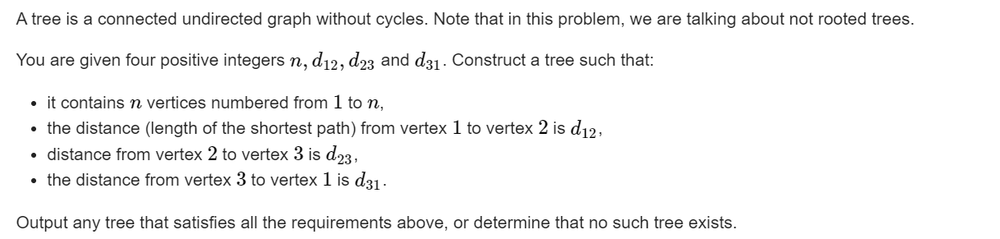

**F. Build a Tree and That Is It**
https://codeforces.com/contest/1714/problem/F


#### sovle

任何方案可以转换成：三个点地最近距离点为根：
可以设出三个点到根地距离， ，然后联立方程组求解：如下：
$$
x , y , z 分别表示三个点地情况。\\
x+ y + z = (d_{12} + d_{23} + d_{31})/2;\\
x+y = d_{12}\\
x+z = d_{31}\\
y + z= d_{2,3}\\
$$

1. 发现sum必须为偶数：否则无解：
2. 三个变量必须是负数， 并且为0地项不能超过1个。

求出上述三个变量之后， 

1. 如果有0就使用对应点为根节点。
2. 如果没有0 ， 就使用4为根节点。
   1. 先处理三个点。
   2. 将剩余点连在根节点上。

#### code

```cpp
const int inf = 1 << 29;
const ll INF = 1LL << 60;
const int N = 1E6 + 10;

int f(int x , int y , int z) {
	return (x + y - z) / 2;
}

void work(int testNo)
{
	int n , d12 , d23 , d31;
	cin >> n >> d12 >> d23 >> d31;
	int sum = d12 + d23 + d31;
	int x = f(d12 , d31 , d23);
	int y = f(d12 , d23 , d31);
	int z = f(d31 , d23 , d12);
	// dbg(x);
	// dbg(y);
	// dbg(z);
	if (sum % 2  || x < 0 || y < 0 || z < 0 || (x == 0 && y == 0) || (x == 0 && z == 0) || (y == 0 && z == 0)) {
		cout << "NO\n";
		return;
	}
	int root;
	int cunt = 4;
	if (x == 0) {root = 1;}
	else if (y == 0) {root = 2;}
	else if (z == 0) {root = 3;}
	else root = 4 , cunt = 5;
	// dbg(root);
	vector<array<int , 2>> edge;
	auto update = [&](int ed , int sum) {
		if (sum == 0)return;
		int cur = 0;
		if (sum == 1) {
			edge.push_back({root , ed});
			return;
		}
		if (cur + 1 < sum) {
			cur ++;
			edge.push_back({root , cunt++});
		}
		while (cur + 1 < sum) {
			cur++;
			edge.push_back({cunt - 1 , cunt++});
		}
		edge.push_back({cunt - 1 , ed});
	};
	update(1 , x);
	update(2 , y);
	update(3 , z);
	if (cunt > n + 1) {
		cout << "NO\n";
		return;
	}
	while (cunt <= n) {
		edge.push_back({root, cunt++});
	}
	cout << "YES\n";
	for (auto [x , y] : edge) {
		cout << x << " " << y << "\n";
	}
}
signed main()
{
	ios::sync_with_stdio(false);
	cin.tie(0);

	int t; cin >> t;
	for (int i = 1; i <= t; i++)work(i);
}
```

