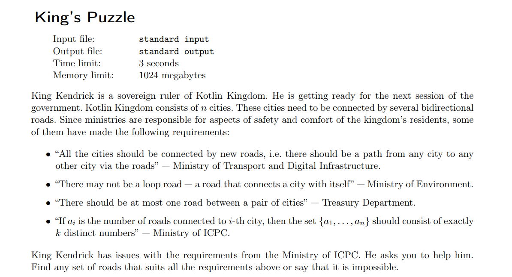

**King’s Puzzle**



#### solve

体现出几点特征：

1. 特殊性：
2. 简洁：
3. 有序：


**从简单的起点开始构造：**从平凡图开始

**有序构造：** 处理若干割点：

**特殊性：** 度数的值域连续 ： 接近$1....k$

然后方案如下：（有解前提下：） 

1. 1 -> 度数为k 。向后边连边：
2. 2 ->度数为k - 1 ， 向后边连边。

然后按照这种规律 ， 逐渐的把所有的点处理完。

最后剩下的点，  并入一个第一个点中。 （妙）

#### code

```cpp
#include<bits/stdc++.h>
using namespace std;
using ll = long long;

const int N = 1E6 + 10;
int main()
{
	ios::sync_with_stdio(false);
	cin.tie(0);
	int n , k;
	cin >> n >> k;
	if (n == 1 && k == 1) {
		cout << "YES\n";
		cout << 0 << "\n";
		return 0;
	}
	if (k >= n) {
		cout << "NO\n";
		return 0;
	}
	cout << "YES\n";
	if (k == 1 && n == 2) {
		cout << 1 << "\n";
		cout << 1 << " " << 2 << "\n";
	}
	else if (k == 1) {
		cout << n << "\n";
		for (int i = 1; i <= n; i++) {
			cout << i << " " << i % n + 1 << "\n";
		}
	}
	else {
		vector<pair<int , int>> ans;
		int d = k;
		for (int i = 1; i <= k ; i++ , d -= 2) {
			for (int j = 1; j <= d; j++) {
				ans.emplace_back(i , i + j);
			}
		}
		for (int i = k + 2; i <= n; i++) {
			ans.emplace_back(1 , i);
		}
		// set<int> rec;
		// vector<int >deg(n + 1, 0);
		// for (auto [x , y] : ans) {
		// 	deg[x]++;
		// 	deg[y]++;
		// }
		// for (int i = 1; i <= n; i++) {
		// 	rec.insert(deg[i]);
		// }
		// cout << rec.size() << "\n";
		cout << ans.size() << "\n";
		for (auto [x , y] : ans) {
			cout << x << " " << y << "\n";
		}
	}
}
/* stuff you should look for
* int overflow, array bounds
* special cases (n=1?)
* do smth instead of nothing and stay organized
* WRITE STUFF DOWN
* DON'T GET STUCK ON ONE APPROACH
*/
```

