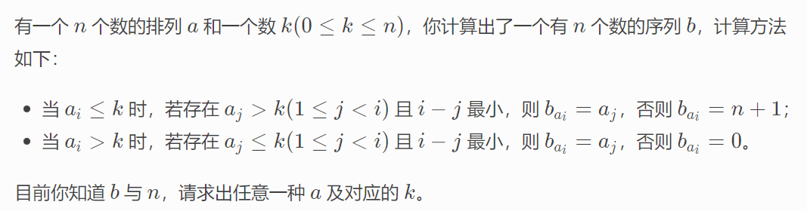

**D. Permutation Addicts**
https://codeforces.com/contest/1738/problem/D

#### 简介：




#### solve

1. 求出k的大小：


#### code

```cpp
#include<bits/stdc++.h>
using namespace std;

using ll = long long;
using i64 = long long;
using ull = unsigned long long;
using ld = long double;
using uint = unsigned int;
using pii = pair<int , int>;
using pli = pair<ll , int>;
using pll = pair<ll , ll>;


#define dbg(x) cerr << "[" << __LINE__ << "]" << ": " << x << "\n"

#define all(x) (x).begin(),(x).end()
#define sz(x) (int)(x).size()
#define pb push_back
#define fi first
#define se second

const int inf = 1 << 29;
const ll INF = 1LL << 60;
const int N = 1E6 + 10;

int b[N] ;
vector<int> g[N];
vector<int>ans;

void dfs(int u) {
	ans.push_back(u);
	for (auto v : g[u])if (sz(g[v]) == 0) dfs(v);
	for (auto v : g[u])if (sz(g[v])) dfs(v);
}

void work(int testNo)
{
	int n;
	cin >> n;
	for (int i = 0; i <= n + 1; i++) g[i].clear();
	ans.clear();
	for (int i = 1; i <= n; i++) cin >> b[i];
	int mi = 0 , mx = n + 1;
	for (int i = 1; i <= n; i++) {
		g[b[i]].push_back(i);
		if (i > b[i]) {
			mi = max(b[i] , mi);
			mx = min(i - 1 , mx);
		} else {
			mi = max(i , mi);
			mx = min(b[i] - 1 , mx);
		}
	}
	if (sz(g[0]))dfs(0);
	else dfs(n + 1);
	cout << mi << "\n";
	for (int i = 1; i <= n; i++) {
		cout << ans[i] << " \n"[i == n];
	}
}
signed main()
{
	ios::sync_with_stdio(false);
	cin.tie(0);

	int t; cin >> t;
	for (int i = 1; i <= t; i++)work(i);
}

/* stuff you should look for
* int overflow, array bounds
* special cases (n=1?)
* do smth instead of nothing and stay organized
* WRITE STUFF DOWN
* DON'T GET STUCK ON ONE APPROACH
*/
```

