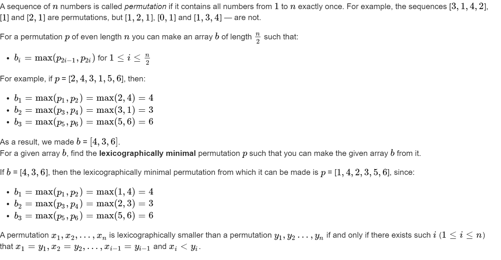

**G. Restore the Permutation**

https://codeforces.com/contest/1759/problem/G



#### solve

字典序相关的贪心：

贪心角度：

正着看：

1. 最小的放前面：
   1. 发现放置最小的过程中，还要check后面是否无解。
   2. check的角度是： 放完最小元素， 是否后边的所有位置都有元素放。
   3. 即使有高效率的check手段， 但是也非常麻烦

平常字典序都是正着放最小。但是由于放置的资源是有限的， 是寻求一个匹配关系。因此可以逆向看；

1. 从后面开始看， 先放可放最大。
   1. 如果问题有解， 显然不会影响解的存在性。
   2. 将小的位置留给前面的位置。

#### code

```cpp
void work(int testNo)
{
	int n;
	cin >> n;
	vector<int> ans(n + 10 , 0);
	vector<bool> used(n + 10 , false);
	bool f = false;
	for (int i = 2; i <= n; i += 2) {
		cin >> ans[i];
		if (used[ans[i]]) f = true;
		used[ans[i]] = true;;
	}
	if (f) {
		cout << -1 << "\n";
		return;
	}
	set<int> rec;
	for (int i = 1; i <= n; i++) {
		if (!used[i])
			rec.insert(i);
	}
	for (int i = n - 1; i >= 0; i -= 2) {
		auto ptr = rec.upper_bound(ans[i + 1]);
		if (ptr == rec.begin()) {
			cout << -1 << "\n";
			return;
		}
		ptr--;
		ans[i] = *ptr;
		rec.erase(ptr);
	}
	for (int i = 1; i <= n; i++) {
		cout << ans[i] << " \n"[i == n];
	}
}
```

