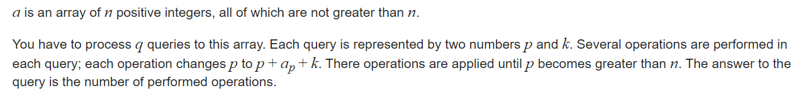

**E. Array Queries**
https://codeforces.com/contest/797/problem/E



#### SOLVE

有两种很显然的方向：

1. 暴力：
   1. 如果k比较小， 每次处理复杂度高达$10^5$
2. 动态规划：
   1. 如果把所有的k处理完 ， 空间复杂度过大， 事件复杂度也过大。

分块分治的思想： 对于k的值不同使用不同的方法：k的分界线取为$\sqrt {n} 约等于 333$ , 于是 两种方法综合使用， 其总的时间复杂度为：$O(n\times\sqrt n)$

#### code

```cpp
const int inf = 1 << 29;
const ll INF = 1LL << 60;
const int N = 1E5 + 10;
const int M = 333;

int f [M][N];
int a[N];

int nxt(int p , int k) {
	return p + a[p] + k;
}

signed main()
{
	ios::sync_with_stdio(false);
	cin.tie(0);
	int n;
	cin >> n;
	for (int i = 1; i <= n; i++) {
		cin >> a[i];
	}
	memset(f , 1 , sizeof f);
	for (int k = 1; k < M; k++) {
		for (int j = n; j >= 1; j--) {
			int p = nxt(j , k);
			if (p > n) f[k][j] = 1;
			else f[k][j] = f[k][p] + 1;
		}
	}
	int sq = sqrt(n);
	int q;
	cin >> q;
	while (q--) {
		int p , k; cin >> p >> k;
		int ans = 0;
		if (k >= sq) {
			while (p <= n) {
				ans++;
				p = nxt(p , k);
			}
		} else {
			ans = f[k][p];
		}
		cout << ans << "\n";
	}
}
```

