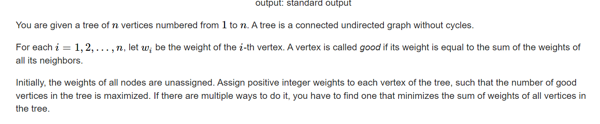

**D. Weight the Tree**
https://codeforces.com/contest/1646/problem/D



#### solve

一些很显然的观察：

1. 相邻节点不可能同时为good点。

然后就天然的转换成了一个树形dp问题：

**状态定义：**

下面两个状态在具体的存储类型中： 为pair<int , ll>类形。第一类取good点的个数。第二类取总权合和的负数（一种trick ， 转最大为最小。取反转最大值为最小问题。使用小于号重载....）

$f_i$：表示 i 点不作为good点的最优方案。

$g_i：$ 表示i点作为good点的的最优方案。

**转移方程**
$$
f_u = \sum _{v \in sons(u)} (g_v > f_v)?g_v : f_v 
$$

$$
g_u=\sum _{v \in sons(u)} f_v
$$
**初始化：**
$$
g_u = make\_pair(1 , deg_u)\\
g_u = make\_pair(0 , 1);
$$

#### 生长思考：

1. 关于树形dp的策略还原： 

   由于是阶段性转移非常具体。递归选择过程，很容易地确定具体最优方案；详见代码。

#### code

```cpp
vector<int> edg[N];
int w[N];
pair<int , ll> f[N] , g[N]; //表示当前是否为好点 ， 的最优方案。
void dfs(int u , int fa) {
	f[u] = make_pair(0 , -1);
	g[u] = make_pair(1 , -sz(edg[u]));

	for (auto v : edg[u]) {
		if (v != fa) {
			dfs(v , u);
			if (g[v] > f[v]) {
				f[u].fi += g[v].fi;
				f[u].se += g[v].se;
			} else {
				f[u].fi += f[v].fi;
				f[u].se += f[v].se;
			}
			g[u].fi += f[v].fi;
			g[u].se += f[v].se;
		}
	}
}
void dfs_(int u , int fa , bool good) {
	w[u] = good ? sz(edg[u]) : 1;
	for (auto v : edg[u]) {
		if (v != fa) {
			if (good) {
				dfs_(v , u , 0);
			} else {
				dfs_(v , u , g[v] > f[v]);
			}
		}
	}
}
signed main()
{
	ios::sync_with_stdio(false);
	cin.tie(0);
	int n;
	cin >> n;
	for (int i = 1; i < n; i++) {
		int u , v;
		cin >> u >> v;
		edg[u].push_back(v);
		edg[v].push_back(u);
	}
	if (n == 2) {
		cout << "2 2\n";
		cout << 1 << " " << 1 << "\n";
		return 0;
	}
	dfs(1 , 0);
	dfs_(1 , 0 , g[1] > f[1]);
	cout << (g[1] > f[1] ? g[1].fi : f[1].fi) << " " << (g[1] > f[1] ? -g[1].se : -f[1].se) << "\n";
	for (int i = 1; i <= n; i++) {
		cout << w[i] << " \n"[i == n];
	}
}
```

