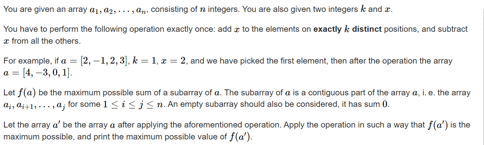

**D. Maximum Subarray**
https://codeforces.com/contest/1796/problem/D



#### solve

首先一个技巧， 先对数组中的所有元素减去一个x先。

**状态定义：**

$f_{i , j}$ 表示前i位元素 ， 并且对前面使用了j次加2*x操作以i为结尾的最大值。

**转移方程：**

1. 可能的解的构造方式有：
   1. 啥也不选（合法 ， 定义为0）。
   2. 与前面的一些数组进行拼接：
      1. 当前考虑的元素上做一次操作。 $f_{i - 1 , j - 1} + a_i + 2 * x$
      2. 不做操作。 $f_{i - 1,j} + a_i$

#### 生长：

1. 对这种贡献类问题 ： 等效转换思想先全部做一次减法。然后问题等效转换成选择一些项加上2*x.
2. 考虑一些细节： 这里的转移是有一定的前提性的： 比如上， 由于是必定要做k次操作的。
   1. 要保证i之前有足够的元素来配合做枚举了的操作个数。
   2. 要保证i之后有足够的元素来处理掉剩下没有完成的操作。

#### code

```cpp
int a[N];
ll f[N][30]; //
void work(int testNo)
{
	int n , k , x;
	cin >> n >> k >> x;
	for (int i = 1; i <= n; i++) {
		cin >> a[i];
		a[i] -= x;
	}
	ll ans = -INF;
	for (int i = 1; i <= n; i++) {
		f[i][0] = max(f[i - 1][0] + a[i] , 0LL);
		if (n - i >= k) ans = max(ans , f[i][0]);
		for (int j = 1; j <= min(k , i); j++) {
			if (i == j) {
				f[i][j] = max(f[i - 1][j - 1] + a[i] + 2 * x , 0LL);
			} else {
				f[i][j] = max({f[i - 1][j - 1] + a[i] + 2 * x , f[i - 1][j] + a[i] , 0LL});
			}
			if (k - j <= n - i) {
				ans = max(ans , f[i][j]);
			}
		}
	}
	cout << ans << "\n";
}

signed main()
{
	ios::sync_with_stdio(false);
	cin.tie(0);

	int t; cin >> t;
	for (int i = 1; i <= t; i++)work(i);
}
```


