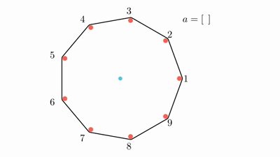

# D. Doremy's Pegging Game

[Problem - 1764D - Codeforces](https://codeforces.com/problemset/problem/1764/D)

Doremy has $n+1$ pegs. There are $n$ red pegs arranged as vertices of a regular $n$\-sided polygon, numbered from $1$ to $n$ in anti-clockwise order. There is also a blue peg of **slightly smaller diameter** in the middle of the polygon. A rubber band is stretched around the red pegs.

Doremy is very bored today and has decided to play a game. Initially, she has an empty array $a$. While the rubber band does not touch the blue peg, she will:

1.  choose $i$ ($1 \leq i \leq n$) such that the red peg $i$ has not been removed;
2.  remove the red peg $i$;
3.  append $i$ to the back of $a$.

Doremy wonders how many possible different arrays $a$ can be produced by the following process. Since the answer can be big, you are only required to output it modulo $p$. $p$ is guaranteed to be a prime number.

多雷米有$n+1$个图钉。有$n$个红色图钉，它们被排列成一个规则的$n$边多边形的顶点，按逆时针顺序从$1$到$n$依次编号。多边形中间还有一个直径略小的蓝色图钉。一根橡皮筋缠绕在红色图钉上。

多莱米今天非常无聊，决定玩一个游戏。起初，她有一个空数组 $a$。当橡皮筋没有碰到蓝色图钉时，她会碰到蓝色图钉：

1. 选择 $i$ ($1 \leq i \leq n$)，这样红色图钉 $i$就没有被移走；
2. 移除红钉$i$；
将$i$追加到$a$的后面。

多雷米想知道下面的过程可以产生多少个不同的数组 $a$。因为答案可能很大，所以只需要输出它的模数$p$。保证$p$是质数。

有$n=9$和$a=[7,5,2,8,3,9,4]$的游戏和另一个有$n=8$和$a=[3,4,7,1,8,5,2]$的游戏



### solve

参考博客：
[CF1764D题解 - honglan0301's blog - 洛谷博客 (luogu.com.cn)](https://www.luogu.com.cn/blog/529697/solution-cf1764d)

**观察现象：**
1. 首先第一个观察，一旦有一段长度$\ge \frac{n}{2}$ 的点被删去，这种变化就会来到终点：

2. 于是问题转变成了一个选点的问题：

**状态定义**
$f_{i , j}$  表示从删去连续的一段1 到 1 + i个点，共删掉j个点的方案数数：

**状态计算**（每一种状态都可以直接计算，所以是一道计数问题， 而不是动态规划问题。）

1. 首先，明确最后一步删除必定$2 ， 1 + \frac{n}{2}$ 以及$i + 1- \frac{n}{2} , i$的交中的。
2. i大于等于$\frac{n}{2}$ 才有贡献，这里的除法指的是向下取整。
3. 除了最后一个点，顺序是任意选择的。
4. 由于圆上处理的对称性质，只要求出一种情况最后通过$\times n$就可以求出总答案了。

**tips**

1. 还漏了当n为偶数时的一种特殊情况：这种情况下，最后一条链的情况可以退化成一个点。

```cpp
const int N = 5E3 + 10;

ll n;
const int C_maxn = 5010;
ll C[C_maxn][C_maxn];
ll fac[N];
void init(const int MOD)
{
	C[0][0] = 1;
	fac[0] = 1;
	for (int i = 1; i < C_maxn; i++) {
		fac[i] = fac[i - 1] * i % MOD;
	}

	for (int i = 1; i < C_maxn; i++) {
		C[i][0] = 1;
		C[i][i] = 1;
		for (int j = 1; j < i; j++) {
			C[i][j] = (C[i - 1][j] + C[i - 1][j - 1]) % MOD;
		}
	}
}
ll f[N][N] , ans;
signed main() {
	ios::sync_with_stdio(false);
	cin.tie(0);
	int p;
	cin >> n >> p;
	const int mod = p;
	init(mod);
	for (int i = n / 2 + 1; i < n; i++) {
		for (int j = i - 1; j <= n - 2; j++) {
			f[i][j] = C[n - i  - 1][j - i + 1];
			f[i][j] = f[i][j] * fac[j - 1] % mod;
			f[i][j] = f[i][j] * (n / 2 + 1 - (i - n / 2)) % mod;
			ans = (ans + f[i][j] * n % mod) % mod;
		}
	}
	if (n % 2 == 0) {
		ans = (ans + fac[n - 2] * n %  mod) % mod;
	}
	cout << ans << "\n";
}
```


