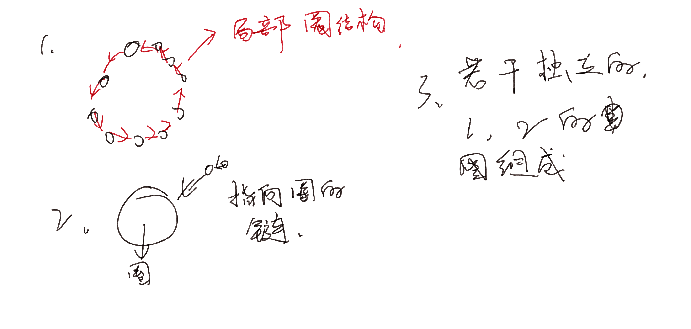

**E. Routing**

[Problem - E - Codeforces](https://codeforces.com/contest/1804/problem/E)

#### 题意简介

给定一个连通的无向图。对每一个点建立参考点，例如$f_{u}$为u的参考点。对每个元素，尝试找出这种集合，满足：对于任意u , v。
关注：$u ，f_(u)， f_{f_{u}}$这样的递归方式中，v和其中一个点直接连接。（v不能是其中的点）

题目中用了一个递归的函数说明这种过程：

#### solve

对于任何一种指派方案:其模型都是一下的情形:



对于上述的情形:

1. $u:$环内的任意点:其与相邻点之间必须存在一条边.否则无法通过$f_a$去到v的附近.这样环内的点,在原有的图中也是成环的.
2. $u:$环外的任意点:其与环内的某一点距离至多为1.否则环内的点没有办法与u交流。

充分条件 : 存在可行方案 -> 原图存在一个环且，环外得点与环中得某一点距离为1.
必要条件：显然对于上述情况，存在一个环且环外的点到环的距离为1。容易构造出一个方案。环内互指，环外点指向环内点。

**在图中找到上述的环结构：**

所以下面补充一些内容：

1. 竞赛图
2. 状态压缩方法求哈密尔顿路径。
3. 哈密尔顿路径和求环：

**总结问题：**

关于2. [basic.md](..\..\..\..\Logrithm\动态规划\状压dp\basic.md) 初学状态压缩dp的笔记。
如果某个环存在，必然会被考虑到，求汉密尔顿路径的过程中可以考虑所有的环。

1. 求出一个状态之后。
   1. 关注起点终点。如果两点之间有路，那么成一个环。
2. 找到环之后呢？怎么检查环外点到环中的距离？
   1. 方案1：对于一种起点求出所有的环，然后check.
   2. ==方案2：使用一些rec数组，在迁移的过程中，记录下当前已经挂在环上的点的信息。（对于每一种图集合，其挂点情况都是一致的）。==
3. 求出一个具体的环后，怎么构造？
   1.  分析：解决路径还原的问题。
   2. 解决方法： 记录状态上一步的使用了什么点。逐渐溯源可以求出路径。


综上复杂度分析：

1. 枚举起点  + 状态压缩dp：$O(N^3\times2^N)$。
2. 考虑一种优化方案：
   1. 在枚举不同的起点的过程中，一些环会被重复计算。
   2. 对于一个序号的起点，只枚举由序号小于等于该点的序号的点组成的环。
   3. 于是复杂度可以控制在$N^2\times 2^\N$

#### code

```cpp
#include<bits/stdc++.h>
using namespace std;
using ll = long long;

const int N = 100;
int g[N];

int main()
{
	ios::sync_with_stdio(false);
	cin.tie(0);

	int  n , m; cin >> n >> m;
	//构建图使用新的技巧。这样可以更加快的更新v.
	for (int i = 0; i < m; i++) {
		int u , v; cin >> u >> v;
		u-- , v--;
		g[u] |= (1 << v);
		g[v] |= (1 << u);
	}
	for (int i = 0 ; i < n; i++)
		g[i] |= (1 << i);
	//下面枚举起点且进行状态压缩dp;
	//先枚举起点：
	for (int st = 0; st < n; st++) {
		//算法实现过程中，需要的一些结构：
		//1,dp【ed】[cur]，表示以 ed为为end ， cur为当前遍历的集合的情况 是否存在方案？保证每一步存在方案即可。
		vector<vector<bool>>dp(st + 1 , vector<bool>(1 << (st + 1), false));
		//表示当前状态下，各种点的可达情况。
		vector<vector<int>>s(st + 1, vector<int>(1 << (st + 1) , 0));
		//表示各种状态的前驱。
		vector<vector<int>>pre(st + 1 , vector<int>(1 << (st + 1) , -1));
		//对上述的一些结构进行初始化：
		dp[st][1 << st] = true;
		s[st][1 << st] = g[st];
		//由于只关注小规模的环。
		for (int cur = 1; cur < 1 << (st + 1); cur++) {
			for (int ed = 0; ed <= st; ed++) {
				//当前状态不存在方案。
				if (dp[ed][cur] == false)continue;
				//检查当前方案是否已经满足成环。等等条件。
				//环外的点距离环距离为1.且起点终点之间存在边。
				if (s[ed][cur] == (1 << n) - 1 && (g[st] >> ed & 1)) {
					//先处理环外部的点；
					vector<int>ans (n);
					for (int k = 0 ; k < n; k ++)
						//检查当前枚举的点是否为环外的点。
						if (!(cur >> k & 1)) {
							for (int t = 0 ; t < n; t++) {
								//当前枚举一个点t满足。t点在图上，并且当前点在环上。

								if ((g[k] >> t & 1) && (cur >> t & 1)) {
									ans[k] = t; break;
								}
							}
						}
					//接下来处理的是环中的点。
					vector<int> cycle;
					int cur_ = cur , now = ed;
					while (now != - 1) {
						cycle.push_back(now);
						cur_ ^= 1 << now;
						now = pre[now][cur_ | (1 << now)];
					}
					//然后园内的点互相指向。
					for (int k = 0; k < (int)cycle.size(); k++)
						//指向上一个点。顺时针逆时针都没有影响。
						ans[cycle[k]] = cycle[(k + 1) % ((int) cycle.size())];
					//最后特判特殊的一类情况。形成自环。
					if ((int)cycle.size() == 1) {
						ans[cycle[0]] =  (cycle[0] + 1) % n;
					}
					cout << "YES\n";
					for (int i = 0 ; i < n; i++) {
						cout << ans[i] + 1 << " \n"[i == n - 1];
					}
					return 0;
				}
				//状态拓展更新。
				for (int k = 0 ; k <= st; k ++) {
					//当前点没有 ，当前点和终点有边。 当前的dp还有计算出来。
					if ((g[k] >> ed & 1) && !(cur >> k & 1) && !dp[k][cur | 1 << k]) {
						dp[k][cur | 1 << k] = true;
						pre[k][cur | 1 << k] = ed;
						s[k][cur | 1 << k] = s[ed][cur] | g[k];
					}
				}
			}
		}
	}
	cout << "NO\n";
}

/* stuff you should look for
* int overflow, array bounds
* special cases (n=1?)
* do smth instead of nothing and stay organized
* WRITE STUFF DOWN
* DON'T GET STUCK ON ONE APPROACH
*/
```


