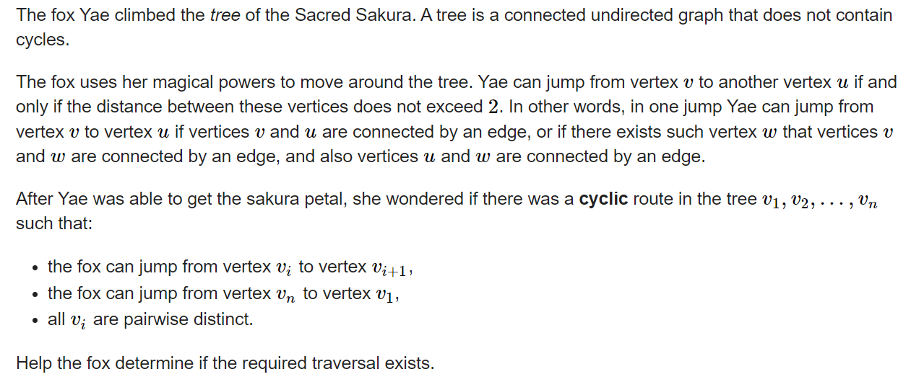
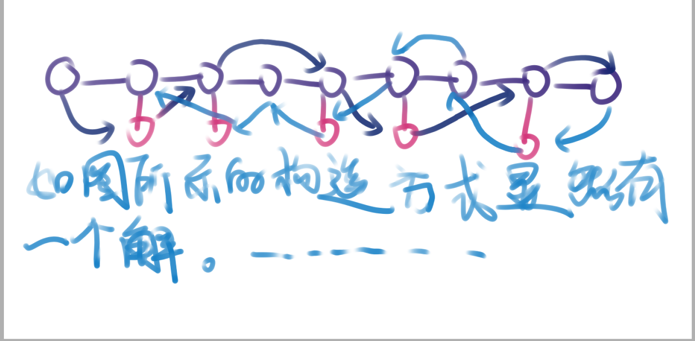

**E. The Fox and the Complete Tree Traversal**
https://codeforces.com/contest/1820/problem/E



#### solve

**猜测一个结论：**
找到一个点， 其它点距离该点的距离小于等于2.这意味着，图上的直径为4。
错误： 具体的反例子为， 可以有一条很长很长的链子。

**基于上述的事实 ， 对结论进行优化更新：**
对于出发点， 每一个子树都是一条单链。

依然有漏洞：
--------
题解 ： 结论：
有解的充分必要条件是 ： 去掉所有叶子节点之后 ，该树本质是一条链。
充分性证明：

1. 找到直径中的一端：

必要性： 如果去掉所有叶子节点之后， 对于要将所有子树走完， 至少要经过度数最大的节点两次。
构造解的方法：如上：模拟上还是有一点难度的。

#### code

```cpp
```


