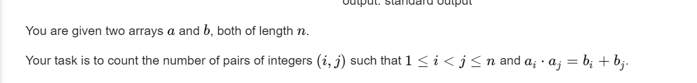

**B. The BOSS Can Count Pairs**
https://codeforces.com/contest/1830/problem/B



#### solve

1. 现象： 

   $b_i + b_j <= 2*n$

   因此可以发现， 选择一个配对时， 其较小端的$a_i \le \sqrt {2n}$

2. 通过上述的启发， 寻找一个复杂度为$n\sqrt n$ 的做法；

   1. 对于一个解 : 枚举较小端 a的大小。然后检查可行解：
      1. 给定一个较小端 s 以及一个pair ，即可以确定唯一确定较小端对应的b

3. 对于a做一个排序， 统计前缀序列中 ， b为某值的pair对的个数。然后统计即可。

4. check贡献统计的正确性：

   1. 独立性： 较小端的大小不一致：
      1. 统计的解必然是不重复的

#### 生长：

1. 感觉朴实无华， 所有点都很熟悉： 但是又觉得很神奇很诡异。


#### code

```cpp
void work(int testNo)
{
	int n;
	cin >> n;
	vector<pii> rec(n);
	for (int i = 0; i < n; i++)
		cin >> rec[i].fi;
	for (int i = 0; i < n; i++)
		cin >> rec[i].se;
	// 枚举第一维度的元素。
	vector<int> cnt(n + 1 , 0);
	// 如果不排序结果不正确。
	// 如果不排序 ， 会出现什么漏解？
	// 匹配第一元素只枚举到了0 .... sqrt(n) ， 如果不排序会漏解。
	/*
	8
	4 2 8 2 1 2 7 5
	3 5 8 8 1 1 6 5
	*/

	sort(all(rec));
	ll res = 0;
	for (int s = 1; s * s <= 2 * n; s++) {
		// 扫描的过程中， 默认枚举第一维度。
		// 然后记录其第二维的情况。
		cnt.assign(n + 1, 0);
		for (auto [a , b] : rec) {
			// 枚举在其前 ，满足题意的解；
			int t = 1LL * a * s - b;
			if (1 <= t && t <= n) {
				res += cnt[t];
			}
			if (a == s)
				cnt[b]++;
		}
	}
	cout << res << "\n";

}


signed main()
{
	ios::sync_with_stdio(false);
	cin.tie(0);

	int t; cin >> t;
	for (int i = 1; i <= t; i++)work(i);
}
```


   
